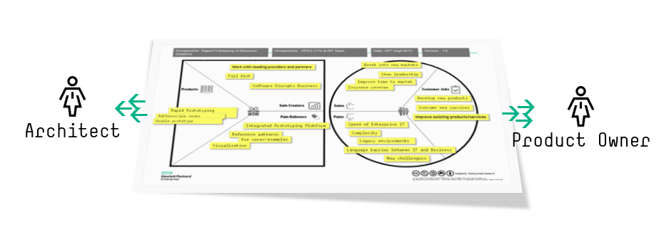
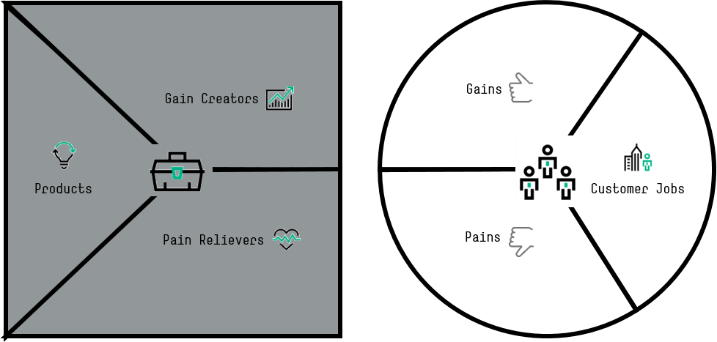
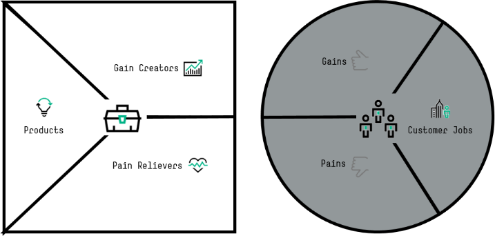
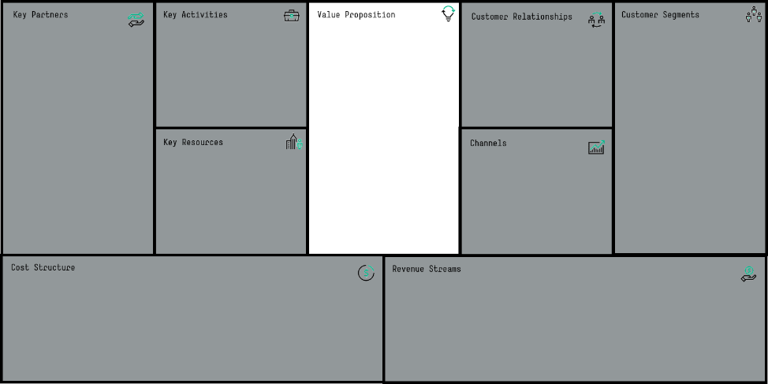
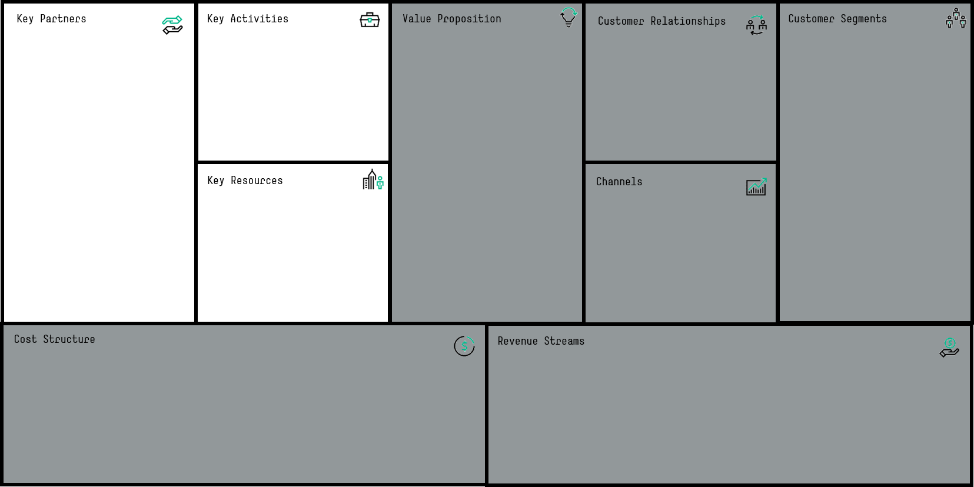
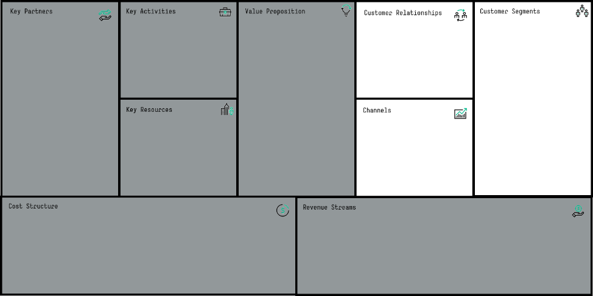
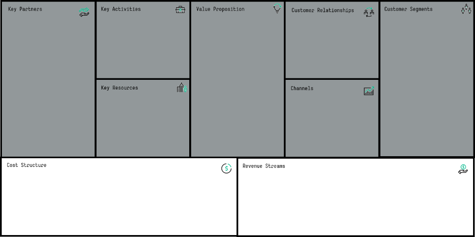

# Insights into the Canvas

Feb 2016

David Stevens

Value Proposition [1] and Business Model Canvas [2] from strategyzer.com provide a rapid, clear and practical approach to developing business solutions.  The information gathered can also be used to shape the architecture and even the Agile project required to realize the solution.   This paper provides an insight into some of the viewpoints each canvas can provide.

 

## Viewpoints on the canvas
A Value Proposition and Business Model Canvas can provide great insight into the vision, goal and requirements of a proposed solution.   As the proposal develops into a formal project this insight can continue for key individuals.  For the Architect and the Product Owner valuable information can be lifted directly from each Canvas, information which will allow each to develop a combined viewpoint of the solution.  Although no hard and fast rule for the mapping, it should be possible to make an informed choice when reviewing each canvas; it is also worth noting that not all entries within the canvas will map out to an architecture class or Agile method.

## The Architect
For the Architect we will look at how to pair elements within the canvas building blocks to the Opengroup Archimate [3] specification.  calling out key motivation classes as well as the high level business services and processes which will be required to be developed or leveraged as the solution is designed.  At this level of abstraction, we are not looking for deep insight into the enabling technology or solution, but a clearer understanding of how the solution could be implemented or at the very least the top level services which can become the focus of the next iteration.

## The Product Owner
The Product Owner [4] is interested in requirements and the agile project and how this may be shaped in order to support the scrum and development teams, understanding the potential features, themes, components or Epics can help the Product Owner to outline an initial project definition, although the Product Owner shouldn’t look to gain insight into individual stories or sprints at this level, the canvas should provide enough of an insight to develop the solution based on the canvas information

## The Value Proposition Canvas
Split into 2 distance sections, the Value Proposition Canvas defines the value of a potential solution and the enabling factors to realize the goal.

### Customer Profile

 
Describing what the customer is trying to get done, the Customer Profile segment describes a specific customer segment related to a solution in detail, covering the required jobs or tasks and any associated gains or pains.

Understanding the risks and obstacles which either impact the customer today or could impact the proposed solution is fundamental to ensure these are known and addressed in the development of any proposed solution.  Gains simply define the benefit or outcome of completing or participating within any given customer job.   This can include current gains which the organization wishes to retain or new desired gains targeted from the proposed solution.    The Pains section outlines the potential obstacles or risk the organization must overcome.

### The Architect’s Viewpoint
Here the Architect can start to understand the motivational perspectives or the underlying or future business processes or functions which could form part of the enabling solution.   Initially mapping to the motivation classes within the architecture model, these will provide key traceability throughout the engagement ensuring the stakeholders have clear line of sight to the proposed solution, based on their initial input.

### The Product Owner’s Viewpoint
Similar to the Architect, the Product Owner can start to understand the high-level Epics and acceptance criteria to include within the developing Agile project.  Being able to validate this at the very outset of the project ensures both stakeholder confidence and also should any further iterations be required these can be addressed quickly.

### Examples viewpoints
As previously stated, there is no hard and fast rule to map information from the canvas to an architecture class or agile method, the Architect and Product Owner must work with the stakeholders to discuss and develop these.  Below are a number of examples

#### Customer Jobs: “Discover new potential solutions for my customer”
The ability to discover new solutions could be a goal of a new solution repository being proposed to support this task.  The same job could also be developed into a detailed business process, allowing the Solution Architect to develop and understand the further touchpoints and interactions required to address this goal within the solution.  Another example could be “maintain in service aircraft”, which again could be developed into a rich and detailed business process.

#### Customer Pain: “High levels of duplication”
This could equate to a negative driver to be addressed within the development of a new solution.  As the driver is explored further within the architecture design, this may result in other activities to ensure this negative influence is reduced or removed as a driving factor within the solution or organization.

#### Customer Pain: “External market changes”
This is a common external event which can have a dramatic effect on both the overall business and the proposed solution, understanding these and preparing a mitigation plan can reduce the risk for a customer in both the development and release of their proposed solution.   A key activity for the Product Owner is to understand these and plan any required mitigation.

Similar to the negative impact drivers within the pains building block, a positive Driver or Goal can be taken from the gains building block of the canvas; An “increase automation” is a potential goal of the board and leadership team of the organization; understanding how the proposed solution will address this goal in a positive way needs to be evident within the proposed solution.   A business goal to increase collaboration between either internal or external partners could become a Requirement or Business collaboration within the architectural model; the collaboration in turn could develop into a defined process between the internal and external parties.

### The Value Map
 

The value segment describes the features and products required to address the customer profile.   These can be existing or new services, business processes or requirements the business needs to consider.   This segment starts to clearly shape the required architecture and potential solution the Product Owner needs to develop.

### The Architect’s viewpoint
As the Architect reviews the gain creators and pain relievers, requirements, processes and services can be identified; these can be articulated further as the business architecture is developed and validated with the Product Owner and stakeholders.

### The Product Owner’s Viewpoint

Very similar to the Architect’s viewpoint, here the Product Owner can start to clearly extract themes and features, plus together with the Architect start to create a mapping between the Agile project components and the functional features within the architecture.   These come together within the Product segment where the target solution or solutions map out across the completed canvas.

### Examples viewpoints

#### Gain Creator: “Work with leading providers and partners”
Outlining a need to work with leading providers as a potential means to ensure the proposed business model is successful can be captured as either a requirement or if the target partners are known a set of new business actors to be included within the development and delivery of the solution.

#### Pain Reliever: “Library of Reference Patterns”
Mitigating the pain of limited reuse or duplication, could be addressed by a requirement to provide a library of reference patterns

Consolidating the information on the canvas into a set of Products, doesn’t necessarily equate to a single project or program; in fact, it’s highly likely these would conclude with multiple projects and services which combined will enable the proposed business solution.  Here the Product Owner may start to breakout and group processes, functions and features into Epics.

## Business Model Canvas
The business model canvas provides a 1-page viewpoint on a business model or solution; this can be a proposal or a representation of an existing solution.  Across the 9 building blocks the canvas outlines the what, the why and the how of any business solution.   Not only providing a common understand for business leaders and stakeholders, as with the value proposition canvas the business model canvas can provide key information to the Architect and Product Owners assigned to realize these goals.

## Value Proposition
 

The centre of the canvas, is the value proposition; the why.  This can be a summarized view from Customer Profile segment of the Value Proposition Canvas or developed solely within the Business Model Canvas.  This central element of the canvas provides key insight to the Architect and Product Owner.

### The Architect’s viewpoint
For the Architect, what are the high level requirements for the solution, what measure or value the solution must exhibit.

### The Product Owner’s viewpoint
Very similar to the Architect’s viewpoint, the Product Owner must understand the acceptance criteria and any associated projects or epics required to meet these goals.

### Examples viewpoints
 
#### Value Proposition: “Reduced lead time”
By ensuring the developed solution reduces the lead time of product releases for a manufacturing company, becomes a key requirement for both the architecture and the project itself.

#### Value Proposition: “Become a talent magnet”
Outlining a global value proposition to shift the belief of an organisation to become a desired team for both existing employees and new starters is a clear goal for a program.  This could also be represented in terms of having a value within the architecture, where the outcome of increases the business value of the team or organisation.

## Enablers
 

The enabling blocks within the canvas outline partners, activities and resources required to realize the solution.  These should not be constrained to known and existing relationships or assets.   Activities and resources should cover both those required to develop the solution and those which will provide the delivery of the solution.

### The Architect’s viewpoint
Here the Architect can extract a rich set of information, stakeholders, required actors and contributors, processes and technical assets which may be required for the solution.

### The Product Owner viewpoint
Similar to the Architect, the enablers block provides a vital set of information for the Product Owner, with almost a 1-2-1 relationship between the Architect’s viewpoint.

### Example viewpoints
#### Key partners: Open Source Community
Developing a new solution using open source products benefits greatly when the community contribute, identifying the key community actors to involve from the start

#### Key activities: Define front-door process
Defining the front-door process to engage with a delivery team is a clear activity to be addressed, this could result in naming stakeholders, actors, roles and processes.

#### Key resources: Support teams
Key resources can identify not only teams (roles) and people (actors) but also if the solution has any constraints in terms of locations these can also be called out.

#### Key resources: Development environment
The need for an environment (physical or virtual) is a key resource to develop the proposed solution with; this could relate to existing assets or new services which need to be made available.

 

## Customer Relationships

 

The customer relationship block within the canvas defines which customer segments the solution is targeting and how the solution will reach those target segments.

unlike the other blocks within the canvas, the Architect may gain some insight from this area, but the real value is for the Product Owner

#### The Architect’s viewpoint
New collaboration processes or stakeholders can be identified within this area and these should be referenced into any business services or processes developed as a result of the identified key activities.

#### The Product Owner’s viewpoint
The relationship building blocks provide key information for the Product Owner, both in terms of stakeholder management, but also engagement and future requirement relationships to be developed.

 

### Example viewpoints
	 	 
 

#### Customer Relationships: Work with Account Executives
Identifying both the stakeholders and required collaborations to be developed is instrumental to the success of the solution

#### Channels: Account Business Plans
Understanding how to propose and present the solution to an existing account through their account business plan, might require the development of a new business collaboration process.

 
#### Customer Segments: Public Sector accounts
Each customer segment may have inherent requirements and locations which can have an impact on the solution architecture and also enabling capabilities across the canvas.

 

## Cost & Revenue

 

The cost and revenue block of the canvas defines both the target cost model, but also the inherent costs related to both the development and delivery of the solution.

#### The Architect viewpoint
License models, existing agreements with vendors and target revenue models have a major impact on the solution and its architecture.   Targeting a value based solution requires different features within the solution over a standard subscription based model.

#### The Product Owners viewpoint
Similar to the Architect, the Product Owner needs to understand the cost and revenue structures, not only to ensure the correct development of the solution, but also to present and discuss these with the stakeholders and customers.

#### Example viewpoints
 	 

#### Cost Structure: Software licence
Understanding the software licence models of both consumed and delivered capabilities would result in either value or contract classes within the architecture.  This is important for both the Architect and solution owner.

#### Revenue Streams: Value based outcomes
The agreed value or savings from the solution can be captured and developed

### Conclusion
This paper shows the potential of using a business model or value proposition canvas and developing down-stream viewpoints, one important point is there is no right or wrong selection to which object class or agile artefact these should map against.  There are clearly some which are wrong, the examples within this paper give an insight into the potential to consume and maintain traceability throughout the development and release lifecycle of any given solution.

---

References
[1] Value Proposition Canvas: http://businessmodelgeneration.com/canvas/bmc

[2] Business Model Canvas: http://businessmodelgeneration.com/canvas/vpc

[3] Opengroup Archimate 2.1 specification: http://www.opengroup.org/subjectareas/enterprise/archimate

[4] Scaled agile framework Product Owner: http://www.scaledagileframework.com/product-owner/