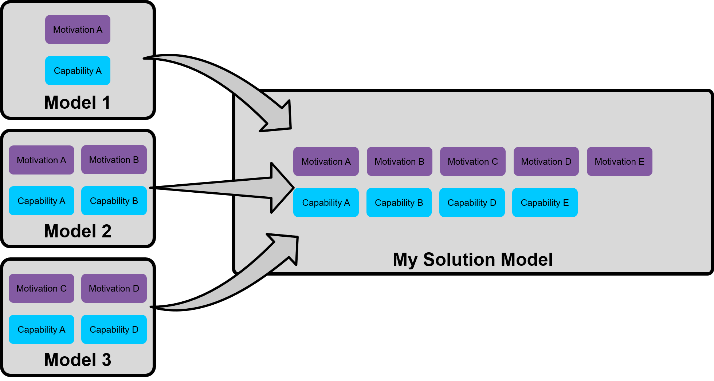
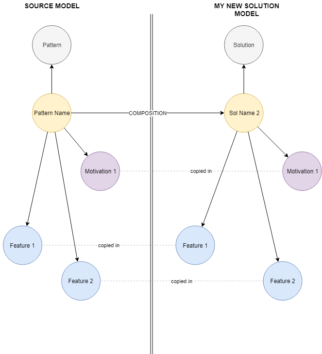
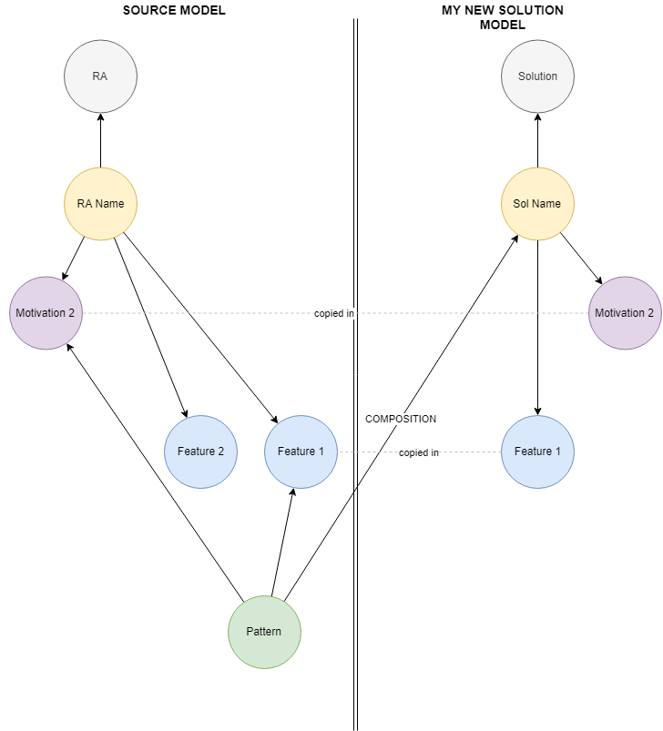
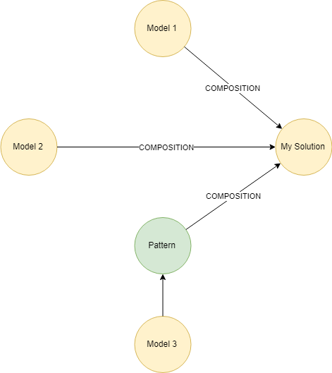

# Composition within Digital Explorer

June 2020

David Stevens

One of the long term aim of Digital Explorer was the ability to allow users to compose solutions, beyond the simple means to reuse a single motivation or feature building block from a catalog of options; but full composition where full solution models can be merged.  Allowing a user base to create reference patterns, offerings and blueprints for others to select from.   As the created solution model is data we can easily manage duplications and call out risks and gaps.

 
In the diagram above, a number of motivations and capabilities are common across the 3 source models; once merged into "My Solution Model" only a single instance is retained.

### Solution types
To ease the usage and aid user experience, only certain solution models will be available as options to be included within other solutions.

The following solution types are available to be merged into a new solution model

- DXC Offering
- Emerging Partner
- Alliance Partner
- Pattern
- Embedded pattern within any other solution

## The Graph Model

When users select to include another model within their own solution model, the motivation and feature nodes are pulled across and reused, with the standard relationships being created between the (new) solution model and the motivations and features from the source model.  A second relationship is created between the solution and the source model, this relationship allows for owners of the source model to track usage.

 
_The image above show the resulting graph model when a full solution model is merged into a new solution model._

 
_The image image shows the result graph model when an embedded pattern from an existing solution is merged into a new solution model._

## Underpinning reference model

The [DXC Digital Explorer solution meta model](https://github.com/dxc-technology/dxc-digitalexplorer/blob/master/DataModels/SolutionMetaModel.md) is the underpinning reference model.

## Usage tracking
As a result of the graph models above, owners of models 

 

## The User Interface

## Add/Edit
As the list of available features and models increases it's important to ensure users have a clear and controllable view of the available models 

### Filters

- Technology group
- Solution status
- Type 

## Data Sheet

The data sheet will show both sides of the composition within the "Origin and Usage" tab.

**Source view**

The solution model has been included within the following solutions...

**Target view**
this solution model include elements from the following other solutions...

## References

[Solution Composition ~ Feb 2016](https://aginggeekblog.wordpress.com/2016/02/24/solution-composition/)
