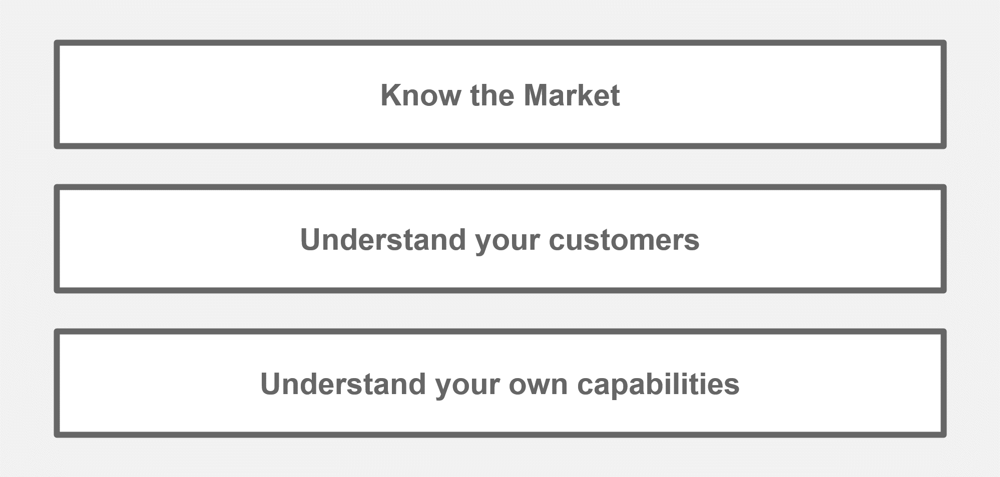
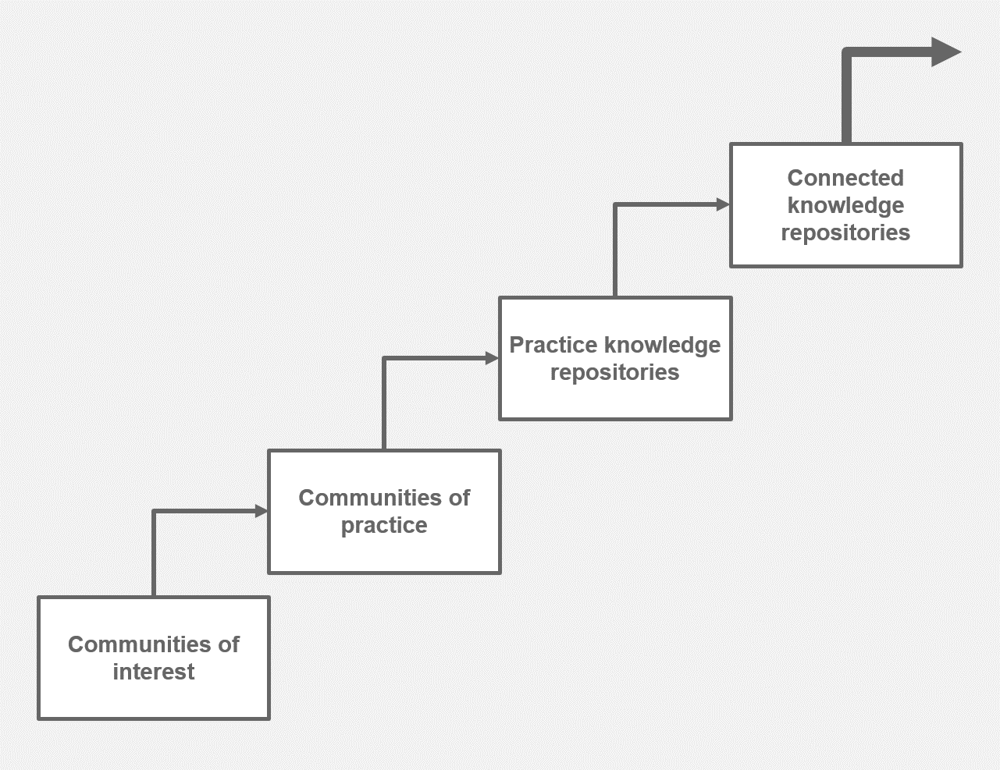
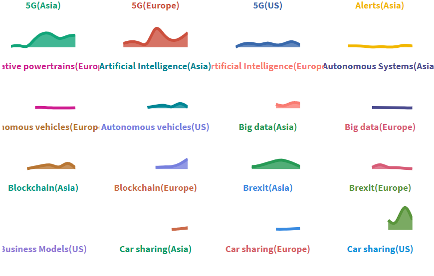
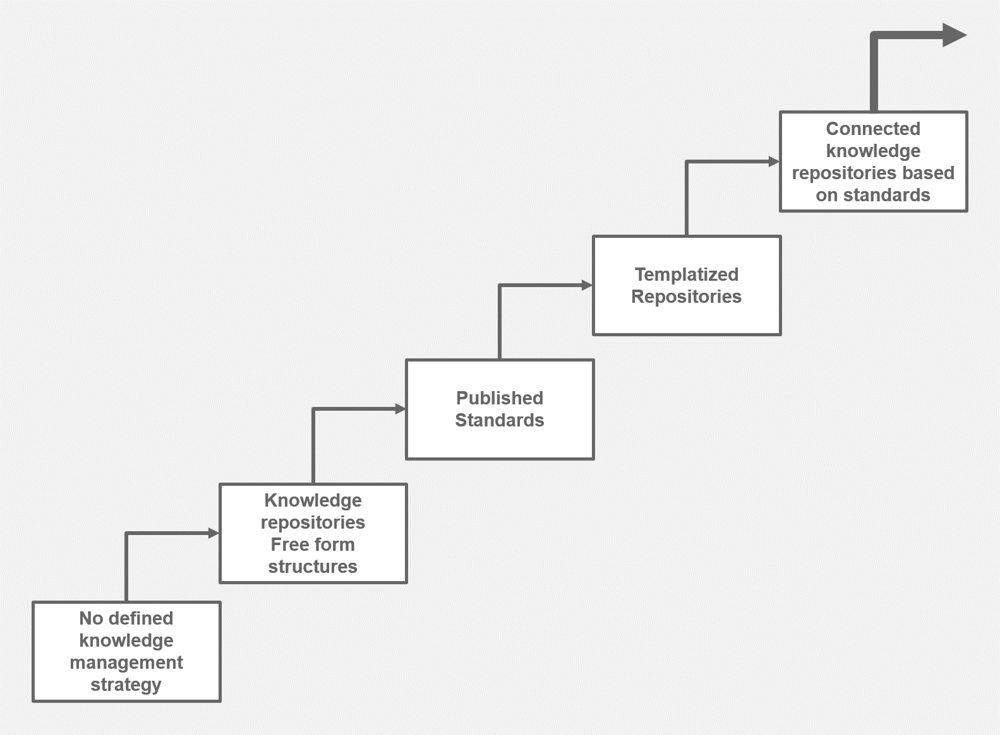

# Roadmap to a Data Driven Organisation

February 2020

David Stevens

Everything we do creates some form of data, the challenge and opportunity for every organisation is to harness that data to unlock even great value.  The more an organisation can connect this information, the more value and efficiencies  can be realized.

I see 3 core aspects which need to understood to create a fully data driven organisation

 

## Know the Market

Understanding the current and potential direction of any market is key to the success of any business, this key foundational aspect defines how far beyond the current horizon an organisation can sense and adapt to change.

### Getting started - Inside viewpoint

Creating **communities of interest and practice** brings experts together, sharing new developments within the market and discussing how this impacts the current organisation is a must; learning from our shared experiences is key.

Internal **support teams**, can help foster both the documentation and sharing of this knowledge, as well as provide key services to help teams research a given topic; providing structure and maintaining records of trusted sources for a given topic or industry.

Provide collaborative knowledge solutions, such as [DXC Digital Explorer](https://digitalexplorer.dxc.com), allowing these communities to share and discuss their knowledge; if scanning across multiple industry sectors ensure there is a central repositories or collection point to allow these teams to gain insights across the board.   A disruptor often has relevance to multiple industry sectors; building a wide view of that disruptor from the start fosters collaboration and growth across these teams.

 

### Outside - In

Engaging with **external analysts** is the first step towards truly understanding the market direction, their breath of knowledge through multiple relationships can accelerate your viewpoints on the potential changes within a market; they can also assist with understanding the future value of these new markets.

### Sensing engines
The growth of social media and open data has had allowed organisations to gain some of the insights external analysts provide themselves; democratizing this knowledge.   However an organisation needs to be aware that unlocking this knowledge does require investment; new and redirected investment from more traditional approaches such as external analysts.  Note, I am not saying all ties with external analysts should be cut, these relationships are key and  form a strategic part of brand and capability awareness with the outside markets, by combining the two an organisation has the potential to dramatically change the relationship with the market analysts; it becomes a discussion on change as opposed to just listening and adapting to their recommendations.

#### Automated platforms
From the early 1980's platforms such as [Bloomberg's Terminal](https://en.wikipedia.org/wiki/Bloomberg_Terminal) have been pulling together vast datasets to allow experts to estimate and forecast the potential direction of the financial markets, however it has only been within recent years that other industries have started to look at the potential of such platforms; cross industry solutions such as [xModus](https://xmotus.io/) and [Faethm](https://faethm.ai/) catalog and model a wide range of social media and other data sources, allowing business analysts the means to cross reference and research a range of topics.   For example, the relationship and potential of *5G* and *autonomous driving*.  Other solutions such as [Fibres](https://www.fibresonline.com/) build upon this concept, allowing you to build upon your existing analysts relationships and combine their knowledge into open data sets.  

---

## Understand your customers

We all know listening to customers is key, but writing it down it just as important. An organisation needs the ability to capture and relate their customers requirements to both the market direction and their own internal capabilities; it's the key point of any data driven organisation.

### Good CRM practices
Cross referencing and analysing the core data within your CRM platform can reveal patterns of opportunity, a small opportunity may be repeated multiple times without product owners or business leaders being aware.   Spent time here both in the analyse of the data, but also on best practices and coaching to ensure sales teams document what is important.

 
*Look for similarity within CRM data*

### Intelligent analytics
#### Self service to fully automated customer 360 platforms.
Text analytics, whilst still not a full commodity service is now available from all the major cloud providers as a set of API enabled services, allowing organisations with the means to assemble solutions which can allow sales and account team the means to read in and view the key themes from a set of customer documents.    Platforms such as DXC's [Digital Explorer](https://digitalexplorer.dxc.com) provide users with a self-service approach to load in RFP's, annual reports and any other related material to create a knowledge model of a customers needs.    Taking each of these individual views into a combined viewpoint allows an organisation the demand signals from any number of dimensions. 

 
*Snippet from automotive trends 2010-2019 - Flourish Studio*

#### Customer 360 platforms
Taking concepts similar to those implemented within XModus and Digital Explorer, it's would be easy to combine the 2, creating an automated customer 360 viewpoint based on a set of given requirements.  You **still need a form of input**, a set of requirements, but it would be very easy to automate the collection of open and published information for many (if not all) organisations globally - annual reports, linkedIn publications, tweets from key influencers within the organisations all combined into a single organisation viewpoint and extended out to a vast industry knowledge pool.

---

## Understand your own capabilities
Understanding your own internal capabilities in a clear and concise manner is crucial.  Start with a clear approach on how to document, share and unlock value from your own products and services, once this is achieved the true potential of a data driven enterprise can be realized.

 

### Unlocking greater value from your products and service models.

### Pattern Analytics
Pattern matching within data is a very standard practice and once your solutions, services are modelled in a consistent manner you will be able to identify [common patterns of capabilities and services](../Patterns/readme.md); remove duplications and identify areas of potential efficiency gains.

### Modelling and composition
The more advanced organisation can take full advantage of a well defined and executed standards, by allowing each capability to become a true building block within an future solution; [solution composition](../Composition/readme.md) or architecture as code 

## Bringing this together - The power of connections

Whilst focusing on one single area can bring great value to an organisation, it's when you connect all 3 that you fully realize the data driven organisation.   Recommendations flow from delivered solutions into the hands of sales, solution owners can plan development backlogs based on outside (data driven) insights, allowing product teams to get ahead of the wave.

There is also the potential to change how resource management is handled within an organisation, by changing the way the supply and demand horizon is captured, we can [pull the horizon closer](../Horizons/readme.md), allowing an organisation the means to adapt to changes across all aspects of an organisation.

--- 

### Let's not forget about Master Data Management

A key under pinning of all these aspects, is a common and maintained taxonomy and information model across the organisation, in fact I would go as far to say this is the first step any organisation has to take; **define the organisations data model and taxonomy**, ensuring all areas of an organisation can exchange information and gain insights.

## Organisation considerations

### Structure
The role of **Chief Data Officer** has seen a massive increase across many industry sectors (finance, healthcare), this role helps drive the data strategy and gain alignment across an organisation. A clear data and knowledge management strategy is key and needs to be supported top down.

### Culture

- Reward collaboration
- Reward the data entrepreneurs 
- Coach and support everyone

### Technical

- Make it easy, **data is open** by default (except where data privacy and other regulations prevent this)
- Data is easy to consume - CSV files are ok!, but also allow other teams to consume via API's and experiment with data visualization and story telling.
- Knowledge ≠ Enterprise search.  Creating lists and indexes doesn't bring value, the data within an organisation is only brings value when it's **used and trusted**.