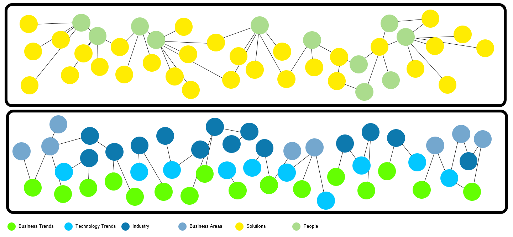
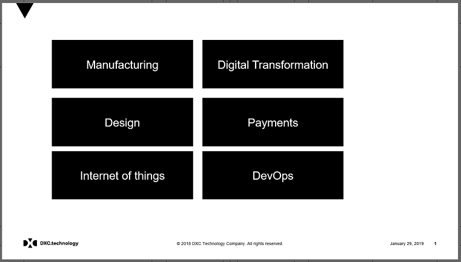
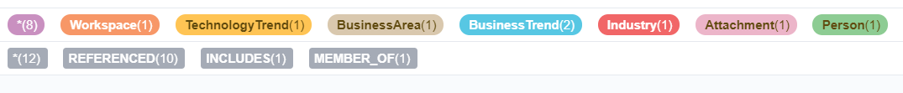
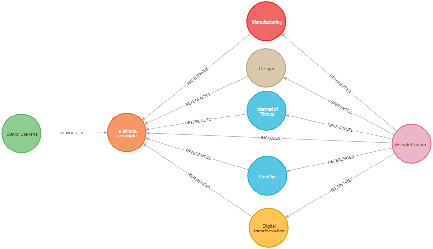
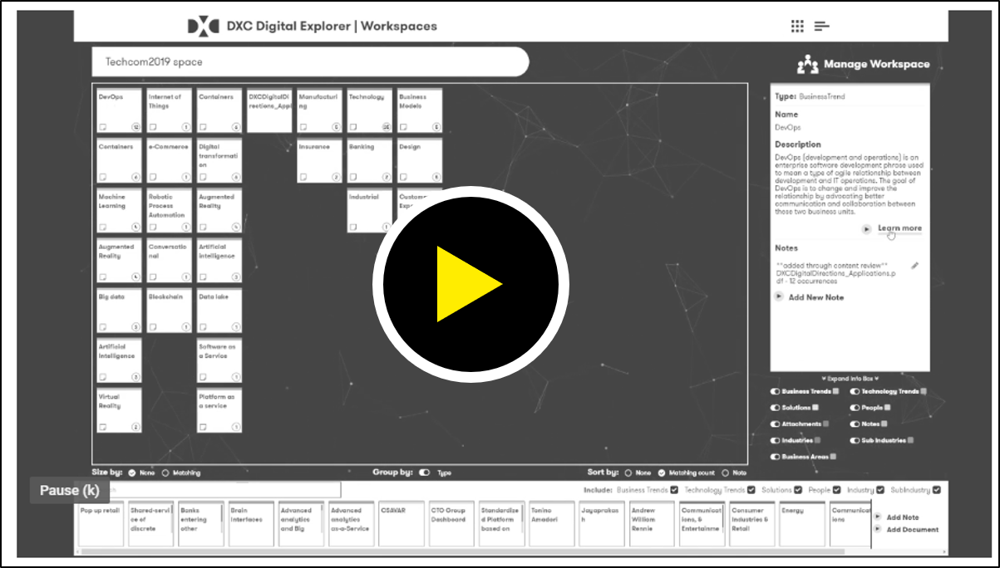
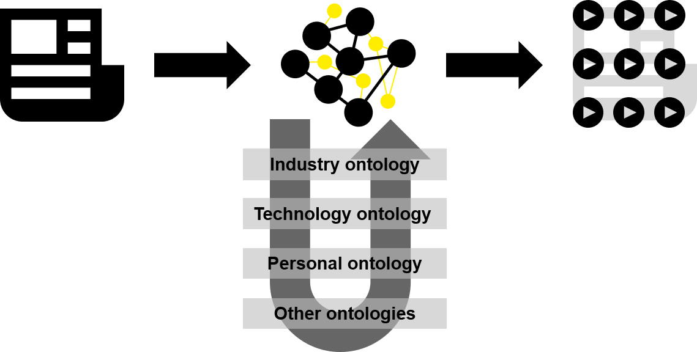

# A Digital Dictionary
David Stevens | DXC Distinguished Architect | DXC Technology Office 

---

Information for any topic is available at the touch of a button or screen; available from multiple sources and at varying levels of quality.   Having a high level of confidence from an information source is paramount for an organisation to make assured decisions and take the appropriate actions.

As a result of the core Digital Explorer work and the a number of side projects harnessing various aspect of the information we have captured within the platform; the trust and position of Digital Explorer as the source of Digital relevance has become apparent.   DXC Digital Explorer is becoming the Digital Dictionary for DXC technology.

 

**Q: Can I upload a document or presentation and extract the key digital drivers and information from it?**

 

Of course the answer is yes and it's a result of a number of smaller prototype projects I have been a part of, both within DXC and as personal side project mainly centred around the principle of being "lazy but smart" ~ see reference work.

This is now realized in a new update available within the Workspace module; a simple yet very powerful concept.

The first implementation within DXC Digital Explorer is fairly simple; a match against the key digital references we currently.

1. Industries and Sub-Industries
1. Key business areas being disrupted by Digital Transformation
1. Digital Industry Trends
1. Technology Trends

Simply put it's  `lower(document.text) CONTAINS lower(IndustryName)` etc.

Even this simple approach results in a very valuable set of information from each uploaded document.  The diagram below is the result of a very simple slide uploaded into the module.

 
 
 

#### Video of the reader in action

**Notes**
- _Payments_ isn't included within the analyse as there are no matching industries, business areas or trends related to the matched industry.    If the industry _Banking_ was included within the document, then the analyses would have included payments as a matching business area.
- Not shown in the diagram but something we are storing is the number of times the match is made within the 'REFERENCES' relationship between the document and the matched node.  This will allow us to do more with the information in a future release.

## Further use cases
This is just the first implementation of this new feature; extended use cases we are already being discussed...

1. Recommendations based on extracted content (solutions & people (WIP))
2. Similarity between a "request" and a "response" (see community detection blog post)[https://englishsid.github.io/GraphCommunityDetection/]
3. Extending the match against a richer graph network - see below

### Matching against a richer graph network
A Digital dictionary brings initial high value, but what is already apparent is the need for a digital ontology (as graph, a _DigitalNet_ or _TechNet_ ).  The Digital Explorer platform currently uses [WordNet](https://wordnet.princeton.edu/) to help with the similarity matching within it's search engine; however the "simple" similarity between words in the English language is not enough for a wider range of industry or technology use cases; for example the means to extract "IAAS" from a document and find and connect to "Infrastructure as a Service" or even "Cloud Computing" is not possible via wordnet or even on initial review [ConceptNet](http://conceptnet.io/).   Extend this further and given the need for industry focused solutions; ontologies need to be applied in across the analysis, I don't believe its a linear flow; it's a mesh of connections.

----
#### Reference work
[1] [NLP within Graph: June 2017 D Stevens](https://aginggeekblog.wordpress.com/2017/06/08/natural-language-processing-using-graph/) 
[2] [Prototype NLP app: June 2017 D Stevens](https://aginggeekblog.wordpress.com/2017/06/20/nlp-bringing-this-together/) 
[3] [DXC Techtalks analytics in Graph: June 2017 D Stevens](https://aginggeekblog.wordpress.com/2017/06/09/nlp-dxc-tech-talks/) 
[4] [NLP connecting to WordNet: July 2017 D Stevens](https://aginggeekblog.wordpress.com/2017/07/07/nlp-connecting-to-wordnet/) 
[5] [another view of a resume: Dec 2017 D Stevens](https://aginggeekblog.wordpress.com/2017/12/13/breaking-down-my-cv/) 
[6] [Breaking down my DXC tech honour's application: Jan 2018 D Stevens](https://aginggeekblog.wordpress.com/2018/01/06/tech-honors-breakdown/) 
[7] [DXC RFI Analytics project: Nov 2018 G Augys, G Chastney, C Rogers, D Stevens :lock: _internal DXC project_](https://github.dxc.com/MyDXCGraph/RFPAnalytics) 
[8] [DXC Digital Skills Analyse: Jan 2019 C Rogers, D Stevens :lock: _internal DXC project_](https://github.dxc.com/MyDXCGraph/DXCSkills)

---

[BACK](../README.md)

---