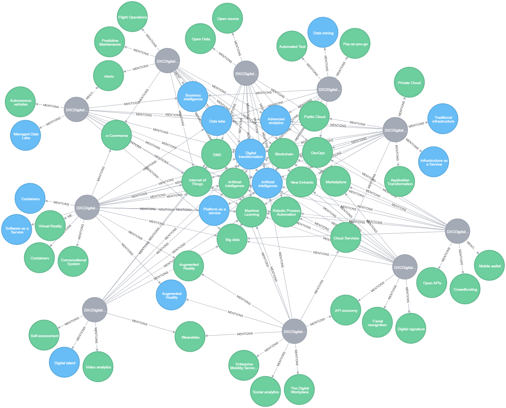

## Trends by count

~~~
match (t:transcript)-[n:MENTIONS]->(tt) 
WITH tt, COUNT(n) AS connections 
RETURN distinct tt.name AS name, connections
ORDER BY connections DESC LIMIT 20
~~~

|name|connections|
|---|---|
Artificial Intelligence|10
Machine Learning|9
Digital transformation|9
Internet of Things|7
Big data|6
Advanced analytics|5
Blockchain|5
DevOps|5
Data lake|4
Robotic Process Automation|4
Business intelligence|3
SMS|3
Marketplace|3
New Entrants|2
Public Cloud|2
API economy|2
Cloud Services|2
Wearables|2
Augmented Reality|2

## Similarity

Results show the number of shared trend connections between each paper (intersection) and the overall similarity score given other trend relationships (similarity)

~~~
match (t:transcript)-[n:MENTIONS]->(Trend)
WITH {item:id(t), categories: collect(id(Trend))} as TrendData
WITH collect(TrendData) as data
CALL algo.similarity.jaccard.stream(data, {similarityCutoff: 0.0})
YIELD item1, item2, count1, count2, intersection, similarity
RETURN algo.getNodeById(item1).name AS from, algo.getNodeById(item2).name AS to, intersection, similarity
ORDER BY similarity DESC
~~~

|From|to|intersection|similarity|
|---|---|---|---|
DXCDigitalDirections_Banking|DXCDigitalDirections_Insurance|8|0.4444444444444444
DXCDigitalDirections_Analytics|DXCDigitalDirections_Transportation|8|0.4444444444444444
DXCDigitalDirections_Analytics|DXCDigitalDirections_Banking|8|0.3333333333333333
DXCDigitalDirections_Analytics|DXCDigitalDirections_Cloud|8|0.2962962962962963
DXCDigitalDirections_Insurance|DXCDigitalDirections_Transportation|8|0.42105263157894735
DXCDigitalDirections_Cloud|DXCDigitalDirections_Security|8|0.4
DXCDigitalDirections_Analytics|DXCDigitalDirections_Insurance|8|0.3333333333333333
DXCDigitalDirections_Analytics|DXCDigitalDirections_Security|8|0.34782608695652173
DXCDigitalDirections_Analytics|DXCDigitalDirections_Analytics|7|0.2916666666666667
DXCDigitalDirections_Analytics|DXCDigitalDirections_Cloud|7|0.3333333333333333
DXCDigitalDirections_Analytics|DXCDigitalDirections_Delivery|7|0.4375
DXCDigitalDirections_Banking|DXCDigitalDirections_Transportation|7|0.35
DXCDigitalDirections_Banking|DXCDigitalDirections_Security|7|0.3888888888888889
DXCDigitalDirections_Insurance|DXCDigitalDirections_Security|7|0.3888888888888889
DXCDigitalDirections_Analytics|DXCDigitalDirections_Transportation|7|0.2692307692307692
DXCDigitalDirections_Analytics|DXCDigitalDirections_Banking|6|0.3157894736842105
DXCDigitalDirections_Banking|DXCDigitalDirections_Cloud|6|0.2608695652173913
DXCDigitalDirections_Banking|DXCDigitalDirections_Delivery|6|0.3333333333333333
DXCDigitalDirections_Analytics|DXCDigitalDirections_Insurance|6|0.3157894736842105
DXCDigitalDirections_Analytics|DXCDigitalDirections_Healthcare|6|0.35294117647058826
DXCDigitalDirections_Insurance|DXCDigitalDirections_Healthcare|6|0.3333333333333333
DXCDigitalDirections_Analytics|DXCDigitalDirections_Delivery|6|0.25
DXCDigitalDirections_Cloud|DXCDigitalDirections_Delivery|6|0.2857142857142857
DXCDigitalDirections_Cloud|DXCDigitalDirections_Healthcare|6|0.2857142857142857
DXCDigitalDirections_Cloud|DXCDigitalDirections_Transportation|6|0.25
DXCDigitalDirections_Healthcare|DXCDigitalDirections_Security|6|0.35294117647058826
DXCDigitalDirections_Analytics|DXCDigitalDirections_Healthcare|6|0.25
DXCDigitalDirections_Transportation|DXCDigitalDirections_Security|6|0.3
DXCDigitalDirections_Delivery|DXCDigitalDirections_Transportation|5|0.25
DXCDigitalDirections_Banking|DXCDigitalDirections_Healthcare|5|0.2631578947368421
DXCDigitalDirections_Analytics|DXCDigitalDirections_Security|5|0.2631578947368421
DXCDigitalDirections_Cloud|DXCDigitalDirections_Insurance|5|0.20833333333333334
DXCDigitalDirections_Healthcare|DXCDigitalDirections_Transportation|5|0.25
DXCDigitalDirections_Analytics|DXCDigitalDirections_Workplace|5|0.2
DXCDigitalDirections_Delivery|DXCDigitalDirections_Insurance|4|0.2
DXCDigitalDirections_Delivery|DXCDigitalDirections_Healthcare|4|0.2222222222222222
DXCDigitalDirections_Delivery|DXCDigitalDirections_Security|4|0.21052631578947367
DXCDigitalDirections_Cloud|DXCDigitalDirections_Workplace|4|0.17391304347826086
DXCDigitalDirections_Insurance|DXCDigitalDirections_Workplace|4|0.2
DXCDigitalDirections_Healthcare|DXCDigitalDirections_Workplace|4|0.2222222222222222
DXCDigitalDirections_Analytics|DXCDigitalDirections_Workplace|3|0.15
DXCDigitalDirections_Banking|DXCDigitalDirections_Workplace|3|0.14285714285714285
DXCDigitalDirections_Security|DXCDigitalDirections_Workplace|3|0.15
DXCDigitalDirections_Transportation|DXCDigitalDirections_Workplace|3|0.13636363636363635
DXCDigitalDirections_Delivery|DXCDigitalDirections_Workplace|2|0.1
