# Digital Demand Modelling

The skills of an individual are instrumental to the success of any organisation; by connecting these skills to the demand signals an organisation captures new methods of strategic planning can be unlocked.   This post outlines the potential of a Graph data model to connect and unlock the  demand potential and strategic direction an organisation may wish to review. 

---

The definition of a `skill` is

`the ability to do something well`

---

First we need to map the skill to an individual

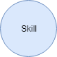 
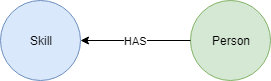 
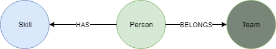 

From this simply model it's possible to understand the available skills within an organisation; however this is a very traditional approach and only captures the current viewpoint of an organisation and requires each individual to maintain their personal skills list.

## How can we track demand to inform of us future skill requirements?

---

The definition of a `demand` is

`the desire of consumers, clients, employers, etc. for a particular commodity, service, or other item.`

---

First we need to understand how the `demand` relates to `skills`.    Stating a _Demand_ requires certain _Skills_ assumes a great deal of knowledge is held by the requestor and this can result in very low level definitions of skills being asked for.  For example `I need people with Azure skills`; this also limits the demand signals to very short term goals.

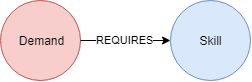 

### Looking beyond today

~~~
Although CRM solutions such as Saleforce (SFDC) provide potentially high value information; these can be limited as they often capture only the committed engagements with a client and not the future opportunities.   Plus the level of detail of the opportunity may be hidden within attachments and externally maintained content.    Therefore we must capture the analyse the approach taken by a sales team to ensure the full picture of proposed engagement and other opportunities is understood; as it's this combination which can give us a better indication of the current and future demands.
~~~

In order to look beyond the immediate demand requests and required skills; organisations must capture and analyse the overall digital strategy of their clients.    DXC Technology addresses this need with the `DXC Digital Blueprint` and the information captured within the `DXC Digital Explorer` platform. 

Firstly we understand that a trend has a potential influence on an industry 
 
But more precisely we define that a trend can influence a value chain within a given industry 
 
DXC Digital Explorer uses this information as the _baseline_ to analyse a client's digital requirements within the `Digital Explorer Workspace` module 
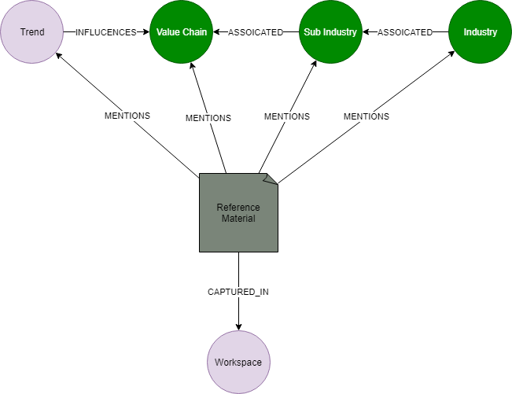 
This analyse is used to shape and build a Digital Blueprint for the client. 
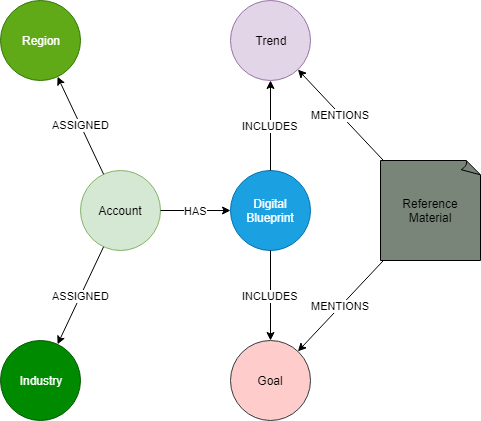 
The blueprint concludes with a set of potential business ideas 
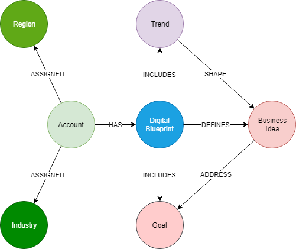 
These ideas are reviewed and a subset of opportunities are defined. 
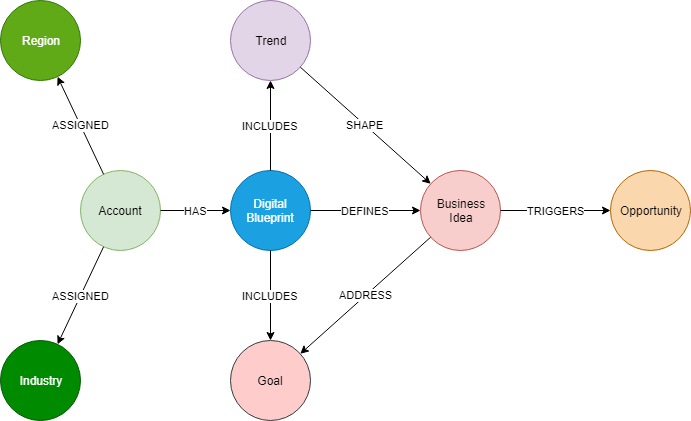 
  
From this process above a very rich set of information has been collected and if we take this in aggregate  

- Common Digital challenges
- Potential Business Ideas
- Selected 

### Getting back to skills.
The core element within the _Digital Blueprint_ is the understanding of the digital trends impacting the individual client and in aggregate the industry or region.   By building a relationship between the skills and the digital trends an organisation can review 3 different horizons.
 
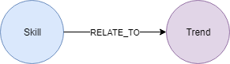 
 
- Short terms needs - skills required for the opportunities 
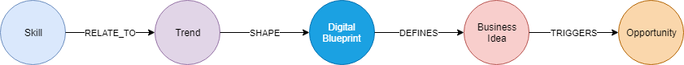 
- Mid term needs - skills required for the business ideas 
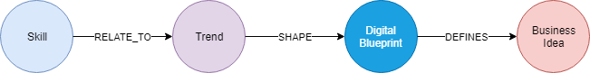 
- Long term needs - skills required for the  
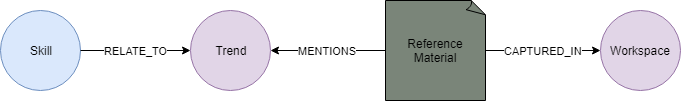 

  
 

:raising_hand: Although you could potential reach out into the CRM/SFDC system to enrich this information set further, this isn't required to create a very rich view.
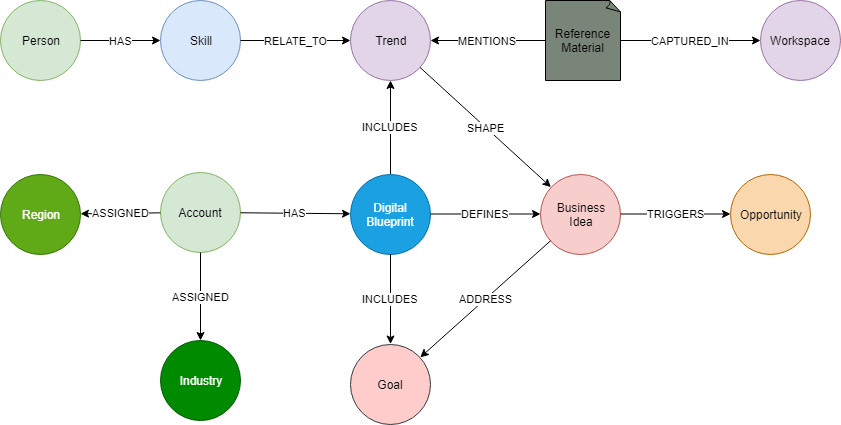 

#### Additional dimensions
Given that a person belongs to an `organsation`, is located in a `country`, belongs to a `team` it's easily possible to draw the required viewpoints against any of these viewpoints; plus as the `account` is assigned to an industry skill demands for a given industry is also possible.

Understanding the skills of an individual is key; maintaining that information in a m

## TO DO
- provide some examples of industry trend/skills demands.
- 
