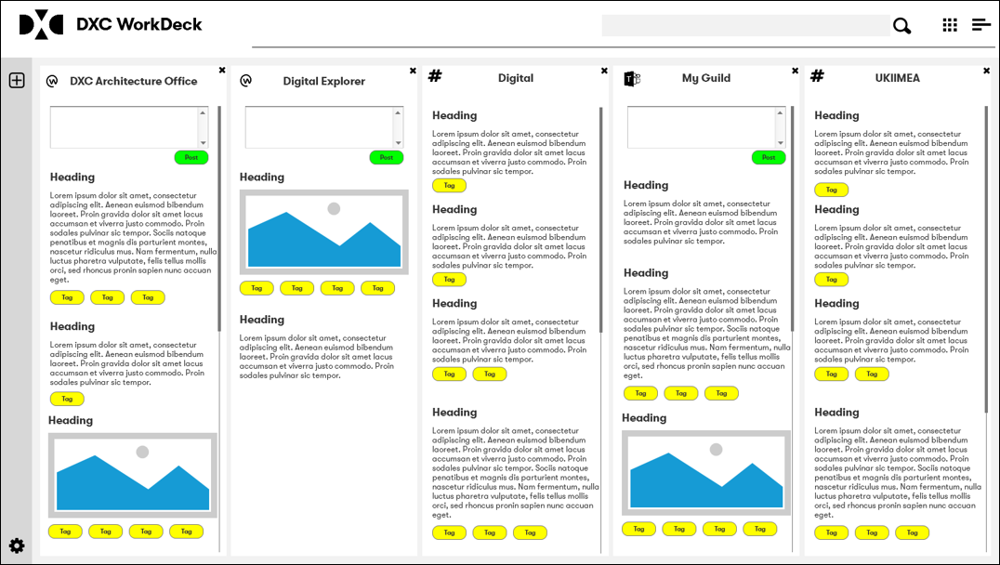

# The Digital Lens

:bulb: _it's just an idea_

Workplace(facebook) and MS Teams are great social and collaboration platform, but both suffer from the same problem “misuse”.   The real challenge though is the viewpoint of misuse is subjective; people share and communicate information with the best interests of the group in mind.  However whilst some will see the value of the post, others will see this as noise and grow in frustration on the potential usage of the platform.   Tagging can help, but again this is down to the person posting giving this some thought and adding the right ones, plus readers filtering down their views based on tags of interest.

In the same matter which we have included a document analyser within the Digital Explorer Workspace module, why can't we pass posts through the same engine?   

People continue to post in the same way they do today and the Digital Lens BOT sits in the background enriching each post with insights relevant to the DXC organisation;  key industries, the digital trends we are tracking and discussing with clients.

Then we can take this a step further; anyone still use [Tweetdeck](https://tweetdeck.twitter.com/)?   We could create our own version, pulling in from workplace, MS teams.  The groups, guilds and selected tag streams...

As I said at the start it's just an idea.