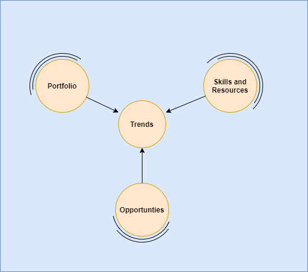

# Pulling the horizon closer

October 2020

David Stevens

Most of my presentations mention the need to "pull the horizon towards us"; here I am referring to the need for an organisation to look beyond their current demand signals and towards the things on the edge of demand; either the current edge of their portfolio or the overall edge of the market.

Today we see 3 main information baselines created to capture the demand signals an organisation uses to inform it's strategy (portfolio, employees, skills, partners, etc.)

### Project resources
Details of the active and soon to be started projects an organisation is delivering (circa. ~4 weeks before the project starts).  Too late to make any immediate changes, but the master source to understand the true nature of delivered projects and the skills and resources engaged.

`What We Sell vs. What We Deliver`

### In Progress Sales Opportunities & CRM systems
Depending on the time scale of the engagement, these could result in demands for project resource being made from everything ranging from 3 to 18 months; the real danger of the CRM system is the **confirmation bias** tracking your own portfolio can bring to an organisation; **"Has the market share changed?"**  or **"Has the market demand changed to something else?"**

### Hypothesis and Ideas
These are the one page idea documents or discussions during an innovation workshop or even at the watercooler; these could be 3 or more months away from developing into a formal sales opportunity, these can also completely disappear from your radar.  If viewed as a single discussion do not provide enough information to see the shift in the market and the changes required to an organisations portfolio. 

`What We Sell vs. What We Need`

## Listening to the signals

I think the challenges and risks to an organisation analysing just their CRM systems is clear; organisations must give sales and account teams simple mechanism to allow the hypothesis to be captured; captured in simple form and a central solution to allow the similarity of these signals to be analysed, both in terms of portfolio, the new enablers but also the associated market value.   The SAFe [epic hypothesis](https://www.scaledagileframework.com/epic/) template is ideally suited for this and is something we have modelled within Digital Explorer

### Connecting islands

 

The horizon is always in front of us, but we can control the speed at which we are chasing it.  If we allow the horizon to move too faraway from us, we will create an even greater distance between our people, our portfolio, partners and the required skills to deliver future solutions.   Organisations must plan to capture and connect various anchor points within these areas; each customer conversations should be analysed and any hypothesis' should call out key trends and terms; skills and associated courses must be pulled closer to these same connection points.   

 

## Related work
Both my current focus projects **Digital Explorer** and **Employee Fingerprint** are two large islands throwing ropes to each other, let's see which organisations (my own?) dock and visit.

`digital explorer`, `digital fingerprint`

---

[BACK](../README.md)

---