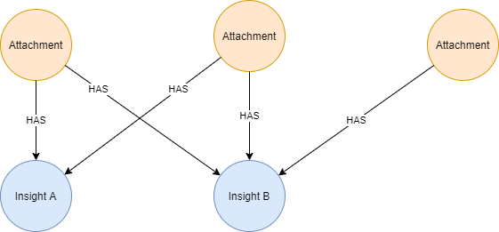
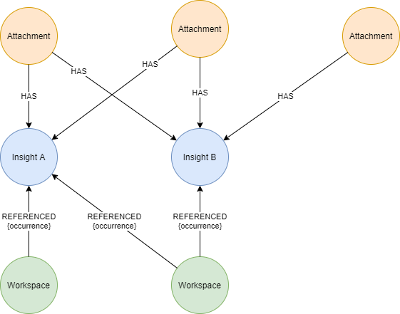

# NLP - Understanding the value of the new insights

November 2020

David Stevens

---

The recent NLP update to the Digital Explorer platform introduced the full text analysis of documents within the Workspace module; the number of insights from a single document can be incredibly high (5000+); how can the value of these new insights be understood?

The graph naturally builds a PageRank value of each insight based on the number of references across the source material, as shown in the diagram below.   Where **Insight B** has a higher PageRank value than **Insight A**.

 

Given the volume of insights created and the number of documents analysed, whilst this does provide some insight into the potential value or relevance of the insight it may not provide the highest value to our users; to address this and ensure insights with the highest value to the users and the outcomes they are seeking, I have included a secondary PageRank calculation against the new insights.

### Referenced PageRank

Instead of just relying on the PageRank calculated based on the occurrence across all scanned documents; the **Referenced PageRank** instead considers the number of times the insight has actually been added to a Workspace by a user.

 

The diagram above includes the same 2 insights as identified in the initial document scans; however in this case **Insight A** has a higher PageRank value as it's been added to more Workspaces.    

This is shown within the Insight view with a simple icon included within the Insight Card

 

---

### Related work

[NLP within Graph](../NLPinGraph/readme.md)

`Azure`, `Neo4j`, `NLP`

---

[BACK](../README.md)

---

