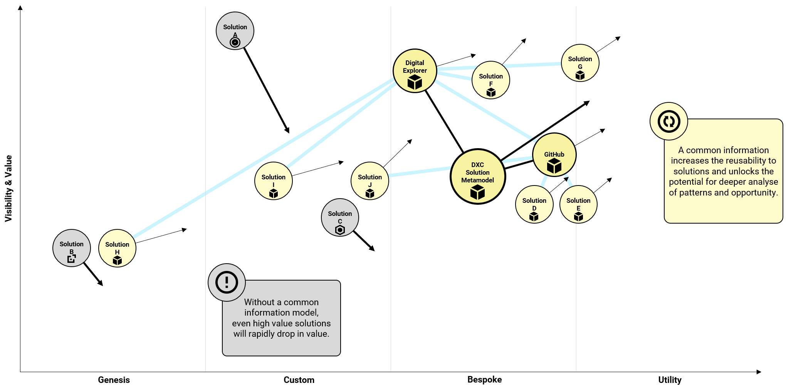

# The value of aligning to a common information model

One of the key elements within Digital Explorer is the underlying solution metamodel and one of the simplest and clearest way to represent this is using a Wardley Map(https://blog.gardeviance.org/2015/02/an-introduction-to-wardley-value-chain.html)

 

 