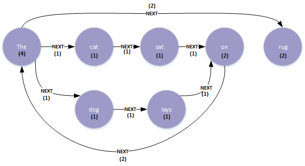

# Natural Language Processing using Graph

June 2017

David Stevens

DXC is a new company and there is a lot of new messaging to understand; the company strategy, market leading play papers, CTO tech talks...   how to make sense of all this.

Can I apply Natural Language Processing to help understand this?

Initial reading : http://www.lyonwj.com/2015/06/16/nlp-with-neo4j/ 

This outlines the means to break a corpus of text down to a word adjacency graph

### Basic Graph model

 

I wanted to build up a profile of keynotes, papers and other sources from key DXC people.   Transcript is the grouping node for each transcript included.

The first transcript was Dan's keynote from the DXC leaders conference.  Dan posted his planned transcript onto the CTO slack channel (thanks  )

Some basic clean-up of the text, search for the best stop words to include and use the import query referenced in the William Post above

The import captures the occurs of both the word and the adjacency count between 2 words.

Example

starting with

~~~
the cat sat on the rug
the dog lays on the rug
~~~

we would see something like

 

So what?

Once we have the transcript in this form we can start to look for common patterns and understand the relationships between words

- word counts
- key phrases
- key word