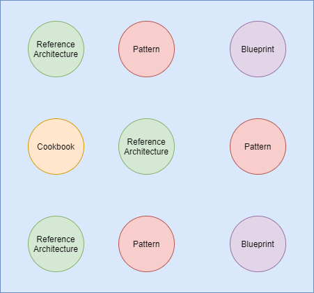
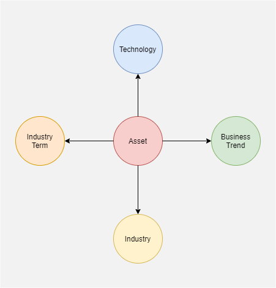
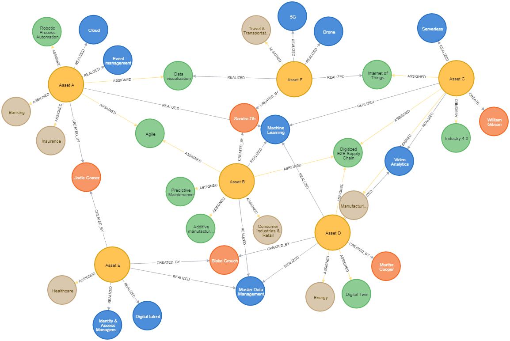
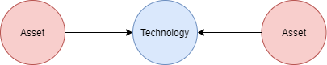
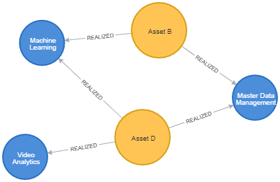
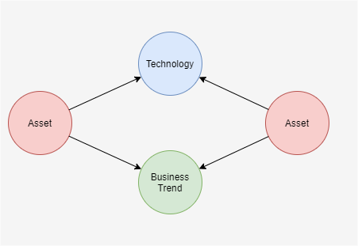

# Patterns from Assets

Organisations create many different types of assets to help articulate the value, implementation and usage of their products or services; Can we extract enough information from the simplest of representations to identify any common pattern or opportunity across this seemingly disconnected products?

 

By running the descriptive text and metadata for any given asset we have the potential to reveal some key insights

- Enabling technologies
- influencing business trends
- key industry terms
- target industry sectors

## Find the patterns

By transferring or storing this information into a structured Graph database we can start to identify potential patterns.

The following examples use [Neo4j (desktop)](https://neo4j.com/) and the [Neo4j Data Science Library](https://neo4j.com/developer/graph-data-science/graph-algorithms/) 

### Creating some sample data

~~~ sql
//Industry List
CREATE (i1:Industry {Name:'Banking'})
CREATE (i2:Industry {Name:'Consumer Industries & Retail'})
CREATE (i3:Industry {Name:'Insurance'})
CREATE (i4:Industry {Name:'Healthcare'})
CREATE (i5:Industry {Name:'Energy'})
CREATE (i6:Industry {Name:'Manufacturing'})
CREATE (i7:Industry {Name:'Travel & Transportation'})

//Enabling technologies

CREATE (t1:Technology {Name:'Cloud'})
CREATE (t2:Technology {Name:'Machine Learning'})
CREATE (t3:Technology {Name:'Video Analytics'})
CREATE (t4:Technology {Name:'Drone'})
CREATE (t5:Technology {Name:'Identity & Access Management'})
CREATE (t6:Technology {Name:'Master Data Management'})
CREATE (t7:Technology {Name:'Serverless'})
CREATE (t8:Technology {Name:'5G'})
CREATE (t10:Technology {Name:'Event management'})

//Business Trends
CREATE (b1:BusinessTrend {Name:'Robotic Process Automation'})
CREATE (b2:BusinessTrend {Name:'Internet of Things'})
CREATE (b3:BusinessTrend {Name:'Predictive Maintenance'})
CREATE (b4:BusinessTrend {Name:'Industry 4.0'})
CREATE (b5:BusinessTrend {Name:'Additive manufacturing'})
CREATE (b6:BusinessTrend {Name:'Data visualization'})
CREATE (b7:BusinessTrend {Name:'Digitized E2E Supply Chain'})
CREATE (b8:BusinessTrend {Name:'Digital Twin'})
CREATE (b9:BusinessTrend {Name:'Agile'})
CREATE (b10:Technology {Name:'Digital talent'})

//Contributors
CREATE (p1:Person{name:'Jodie Comer'})
CREATE (p2:Person{name:'Sandra Oh'})
CREATE (p3:Person{name:'William Gibson'})
CREATE (p4:Person{name:'Blake Crouch'})
CREATE (p5:Person{name:'Martha Cooper'})

//Assets
CREATE (a1:Asset {name:'Asset A'})
MERGE (a1)-[:CREATED_BY]->(p1)
MERGE (a1)-[:ASSIGNED]->(i1)
MERGE (a1)-[:ASSIGNED]->(i3)
MERGE (a1)-[:ASSIGNED]->(b1)
MERGE (a1)-[:ASSIGNED]->(b6)
MERGE (a1)-[:ASSIGNED]->(b9)
MERGE (a1)-[:REALIZED]->(t1)
MERGE (a1)-[:REALIZED]->(t2)
MERGE (a1)-[:REALIZED]->(t10)

CREATE (a2:Asset {name:'Asset B'})
MERGE (a2)-[:CREATED_BY]->(p2)
MERGE (a2)-[:ASSIGNED]->(i2)
MERGE (a2)-[:ASSIGNED]->(b3)
MERGE (a2)-[:ASSIGNED]->(b5)
MERGE (a2)-[:ASSIGNED]->(b7)
MERGE (a2)-[:ASSIGNED]->(b9)
MERGE (a2)-[:REALIZED]->(t2)
MERGE (a2)-[:REALIZED]->(t6)

CREATE (a3:Asset {name:'Asset C'})
MERGE (a3)-[:CREATED_BY]->(p3)
MERGE (a3)-[:ASSIGNED]->(i6)
MERGE (a3)-[:ASSIGNED]->(b2)
MERGE (a3)-[:ASSIGNED]->(b4)
MERGE (a3)-[:ASSIGNED]->(b7)
MERGE (a3)-[:REALIZED]->(t2)
MERGE (a3)-[:REALIZED]->(t3)
MERGE (a3)-[:REALIZED]->(t7)

CREATE (a4:Asset {name:'Asset D'})
MERGE (a4)-[:CREATED_BY]->(p4)
MERGE (a4)-[:CREATED_BY]->(p5)
MERGE (a4)-[:ASSIGNED]->(i5)
MERGE (a4)-[:ASSIGNED]->(i6)
MERGE (a4)-[:ASSIGNED]->(b7)
MERGE (a4)-[:ASSIGNED]->(b8)
MERGE (a4)-[:REALIZED]->(t2)
MERGE (a4)-[:REALIZED]->(t3)
MERGE (a4)-[:REALIZED]->(t6)

CREATE (a5:Asset {name:'Asset E'})
MERGE (a5)-[:CREATED_BY]->(p1)
MERGE (a5)-[:CREATED_BY]->(p4)
MERGE (a5)-[:ASSIGNED]->(i4)
MERGE (a5)-[:REALIZED]->(b10)
MERGE (a5)-[:REALIZED]->(t5)
MERGE (a5)-[:REALIZED]->(t6)

CREATE (a6:Asset {name:'Asset F'})
MERGE (a6)-[:CREATED_BY]->(p2)
MERGE (a6)-[:ASSIGNED]->(i7)
MERGE (a6)-[:REALIZED]->(b2)
MERGE (a6)-[:REALIZED]->(b6)
MERGE (a6)-[:REALIZED]->(t4)
MERGE (a6)-[:REALIZED]->(t8)
~~~

- [Sample Data Script](scripts.cql)

 

### Simarility of Assets - Single points of reference

A simple similarity query is to identify which of the assets have share relationships to one of the common data points; maybe we wish to compare the assets for common enabling technologies.

 

Within the Data Science Library we can create a sub-Graph of just this area.

~~~
CALL gds.graph.create('myGraph',['Asset','Technology'],'REALIZED')
~~~

~~~
CALL gds.nodeSimilarity.stream('myGraph')
YIELD node1,node2,similarity
RETURN gds.util.asNode(node1).name AS Asset1,gds.util.asNode(node2).name AS Asset2,similarity
ORDER BY similarity DESCENDING,Asset1,Asset2
~~~

Asset1|Asset2|similarity|
|---|---|---|
|"Asset B"|"Asset D"|0.66
|"Asset C"|"Asset D"|0.5
|"Asset A"|"Asset B"|0.25
|"Asset B"|"Asset C"|0.25
|"Asset B"|"Asset E"|0.25
|"Asset A"|"Asset C"|0.2
|"Asset A"|"Asset D"|0.2
|"Asset D"|"Asset E"|0.2

The result show us Assets B & D are similar with the highest set of common technologies.

 

### Removing the graph from memory

~~~
CALL gds.graph.drop('myGraph')
~~~

## Similarity across 2 or more reference points

Whilst analysing a collection of assets against a single common reference point can highlight common patterns, we may wish to extend this to include other reference points; "Is there any similarity between both the enabling technologies and the high level business needs being addressed?"

 

**TO-DO**

---

Reference work

[Patterns](../Patterns/readme.md)

---

---

[BACK](../README.md)

---