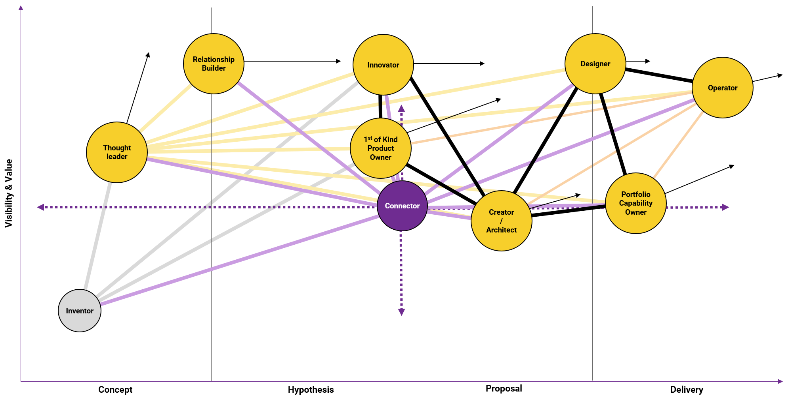

<time class=”entry-date published” datetime=”2019–04–15T10:25:32+00:00">September 1, 2020</time>
<time class=”updated” datetime=”2019–09–12T10:35:33+00:00">September 1, 2020</time>

# Personas of a customer engagement

Recently we took a decision to change how to position the Digital Explorer platform to our users, no longer talking about it's benefit for a given job title, but instead focusing on the outcome the user wishes to achieve.    In essence the Persona.

we then mapped the Personas against a customer journey, using a [Wardley Map](https://medium.com/wardleymaps) to give a viewpoint on value and direction of travel.

 

## Thought Leader

### About
- Knowledge hunter and community leader whose expertise is sought and often rewarded
- Turn ideas into reality and challenge the world in meaningful ways and engage others in those efforts
- Works with external analyst's and defines strategies 
Isn't afraid to share

### Wants & Needs
- Relevant and connected trends aligned to market signals and demands
- A great product or service to form a natural community 

### Expectations
- Seeking engagement which allow for nurturing to lead to more opportunities (high quality content, more open doors)
- Ability to connect with gatekeeps and influences…

### Digital Explorer Modules

### Motivations
- Cross industry knowledge connected through trends and solutions
- Customers have an easier time trusting products and services associated with a trusted thought leader…

### Frustrations
- Thought leaders/leadership is not utilized or leveraged effectively across One DXC

---

## The Relationship Builder

### About
- New to DXC or a customer account/sector
- Likes to have enjoyable conversations with their clients, they seek to satisfy customer demands and provide a good experience

### Wants & Needs
- Understand the current market trends impacting a given industry and the customer value chains
- Understand the potential for DXC to help the customer

### Expectations
- Information is easy to find
- Information is accurate
- Information is engaging

### Digital Explorer Modules

### Motivations
- Build creditable relationship with their customer

### Frustrations
- Many information sources
- Impossible to understand everything

---

## The Innovator

### About
- Unconstrainted thinker, focused on an industry but seeks and is aware of opportunities from all sectors
- Drives customer innovation workshops
- Seek areas of competitive advantage and can re-imagine things that already are

### Wants & Needs
- To capture and share emerging opportunities 
- Find similar opportunities from other innovators
- Ability to harvest the proof points of our innovations

### Expectations
- Ideas continually evolve and clients are seeking innovative solutions to meet their current and future business needs…
- Tools and resources are available to challenge the status quo, push the boundaries and achieve growth

### Digital Explorer Modules

### Motivations
- Technology challenges are met through innovative ideas…

### Frustrations
- Unable to connect great innovative ideas to promote use…
- Lack of transparency into the innovations we bring to our customers

---

## The Designer

### About
- Solution lead on a new customer engagement
- Account executive on an existing account
- Responds to customer inquiries with standardized solutions (mostly those that they are familiar and have solutioned before)
- Brand-driven and risk-adverse (not interested in early adoptions or trailblazing)

### Wants & Needs
- To provide a strong solution and response to a client inquiry
- Ability to bring forward client success stories to illustrate and support the solutions
- All solutions are backed up by hard facts and data

### Expectations
- Solutions are aligned up and down the technology stack
- The skills needed to deliver these solutions are understood
- Solutions are proven and have been delivered before

### Digital Explorer Modules

### Motivations
- Build a deeper understanding of the client challenges and how our technology solutions align to meet their goals
- Real-world case studies and client successes to illustrate alignment

### Frustrations
- Unsure as to what level of confidence DXC has delivered the solutions
- Ability to find solutions to meet client needs and goals

---

## The Creator/Architect

### About
- Shapes ideas into deliverable solutions
- Seeks to design and deliver a great product for the client
- Values quality above all else and may often need to offer compromise based on the client’s budget and time

### Wants & Needs
- To connect innovative ideas to solutions
- Reuse existing patterns and assets
- Compose complex solutions
- Validate proposed solutions met the customer requirements

### Expectations
- Solutions meet client needs and align with market trends
- Referenceable data sets are easy to find
- Needs quick, reliable assets that are appropriate (cost/quality) for the client
- One stop shop for building products …

### Digital Explorer Modules

### Motivations
Solutions are referenceable and repeatable and meet the current demands from our customers
Never enough time and hates having to go through dozens of tabs/links to find the assets that fit

### Frustrations
- Too many solutions to meet unique needs
- Difficult to reuse
- Quality, price and lead-time to deliver 
 -Too many repositories 
- No standards

---

## Product/Capability Owner

### About
- Product owner for an internal offering or solution
- Partner capability owner
- Seeking to maximize the value of the product(s) produced and ensures they meet the needs of the identified users

### Wants & Needs
- To understand potential customer demands against existing products and capabilities 
- Gain insight to future product and capabilities demands
- Looking for accounts and or deals in which to position their product or capability

### Expectations
- Has access to customer demand signals
- Has access to product insights within the market
- Has access to Competitive intelligence 

### Digital Explorer Modules

### Motivations
- Prioritize product development against true market demand

### Frustrations
- Disconnect between regional/customer engagements and central portfolio
- Standard offerings are ignored/not selected
- Feedback loops are sporadic or non-existent

