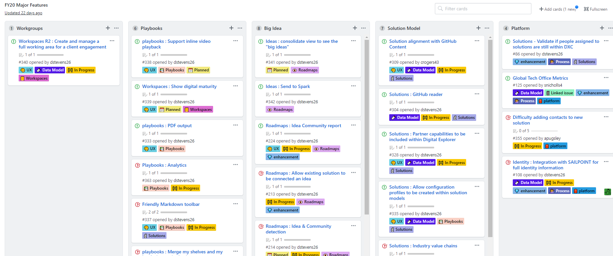

# The Product Owner

I hear this a lot "look at how Dave approaches his community and product development; you should leverage..." and I'm not sure I do anything that special, but I keep hearing it so thought I'd try and make sense of it and write down some (maybe all) of the things I do to support the development, awareness and usage of the [DXC Digital Explorer](https://digitalexplorer.dxc.com) platform.

## Background

The DXC Digital Explorer solution is an DXC platform for our sales and accounts teams to analyse and shape client requirements; a graph based solution build on top of [Neo4j](https://neo4j.com).  It's internally developed by a very small team (floating between 2-4 resources depending on current funding and availability); given the small size of the team, I have a number of roles, not ideal but at the moment it works.

- Product owner : :heavy_check_mark:
- UX lead : :heavy_check_mark:
- solution architect : :heavy_check_mark:
- tester : :heavy_check_mark:
- scrum master : :heavy_check_mark:

I'd say I do the last 2 roles very poorly, but the team is small and we get by.

Another interesting factor in this is we are a remote team, I am based in the UK and my development team are in Poland (and not all in the same office), so we are very reliant on collaboration platforms to stay connected as a team.

## Our toolchain and social channels

This is the key to all of this, understanding and getting the best out of the mix of community platforms available within an organisation and we have a lot...   

Available tools/platforms

- MS Teams
- GitHub
- Jira
- Workplace
- Skype
- [DXC.MediaPlatform](https://dxc.mediaplatform.com/)
- Email

First let's strike email off the list, we **don't** use it.    Technically not true, but it's only used to enable alerts from our cloud platform and in reality these also go into a channel on our development MS Teams site.    But it's not used to share or discuss anything within the team; well maybe 1 or 2 "oh sh#t the site is down" emails in the past.   

### Breakdown of each platform

#### MS Teams
2 sites created. 
The **Dev only site** is where we schedule and manage our stand-up calls from.   Plus it has channels set-up to receive alerts from azure and the backend services in case things go wrong.

The main usage of this site remains the stand-up calls and a general chat channel for the team.   We share photos from events and random non-work posts.

`no documentation is left in MS Teams over night` ;)

**The guild site**, still a work in progress.   Thinking was, as we assemble champions and engaged stakeholders they join the Guild and start to be more involved with the prioritization of the roadmap.   In reality this isn't the case, I actually think the workplace group has the potential to address both audiences; general users and those who want to be a part of a guild to help shape the product.

Current community engagement : low :arrow_lower_right:

#### Skype
Used for 1-on-1 IM's only, although we have seen a recent shift to doing this more and more in MS Teams.

#### Workplace
One group and the single channel to share all the release videos into and give a wider community a sense of the developing items and thoughts within the backlog.   As well as the videos, I share training announcements, mock-ups of new ideas taking shape; plus also champion the best content creators within the platform.   Digital Explorer is a knowledge creation platform, an empty platform with no creators has zero value.  

Current community engagement : high :arrow_up:	

#### GitHub
In my view this is the reason I'm successful with Digital Explorer.   **Everything** we do is available on GitHub, when I say everything is on GitHub, I mean everything.

the code, yes that's a given, but also all user documentation and development notes (including the ideas which never make it) are there.  Plus, and this is the real hook, our backlog is here and it's open to everyone to add an issue into.   Defects, ideas, questions are all raised here.

Current community engagement : high :arrow_up:

#### Jira
Restricted to just the development team and myself; this is where the sprints and activity is tracked on a day-2-day basis.  The backlog items are copied (manually) from GitHub into Jira and grouped, reviewed, scored into Epics within Jira.   Sprints are run, boards updated, comments, questions raised.

This is the primary channel the core team use to discuss our work; comments and questions from the stand-up calls are added to the issues, the combination of a group of completed epics triggers the "we have a release discussion"

#### Media Platform
Video hosting only - I don't use this as an entry point at all.  Videos references are redirected to here, but the platform lacks the social interaction required so I simply use this solution to host the videos.

Current community engagement : low :arrow_lower_right:

### Other tools

#### [OBSStudio](https://obsproject.com/)
An excellent open source solution for video creation.    When we have a licence for Adobe captivate I used that; I wish I had made the switch to OBS earlier.

#### PowerPoint
It still has it's uses, diagrams, single slides to introduce the release video.   More and more I am finding my PowerPoint files are just sketch pads of various diagrams I copy, paste and save into other tools.

#### Jenkins
Key for us and automates all of our deployments.

- merge into development branch - deploy to development
- merge into master - deploy to integration

I manually deploy to production, but it's a simple click against each repo following the testing and validation on integration.

#### Axure
All our designs and mock-ups are created using [Axure](https://www.axure.com/).    Fairly sure I have other options available, but my design file is so rich now with templates, standard widgets, etc.  It would be a massive task to move to something else right now.
 
It's also quite interesting to go back to some of the old designs and features and see how far the product has come.

#### Draw.io
When required simple diagrams are created using [draw.io](https://www.draw.io/)

---
## So what...
So those are the tools and platforms, but what's my approach.

1. Stand-up calls - yes it's a key factor of Agile, but don't under estimate these.   Keep them regular, keep them short, keep them informal.  I think every Friday I have another midlife crisis as another highly productive week goes by with the team.
2. Listen and watch 
    Present the vision, give the training, but most importantly listen and watch how people actually use it or want to use it.
3. Be open minded 
    What you think is THE feature probably isn't
4. Share the good points and the bad points 
    Call out the great work people are doing with the product and don't be afraid to share what didn't work and how you plan to address them.
5. Post frequently 
    Even if it's a "fixed minor issues" only release - share this with the user community.  The issues were most probably reported to you by one or more users - keep them engaged; you'll most likely find new product champions.  This also extends to the GitHub issues list.
6. Keep to your vision.    Be mindful of even small creeps of scope - keep it focused, keep it tight.  small tailored product, delivered by a small product team.    No platform is going to be the single solution for an entire organisation.
 

I think one of the key advantages of an Agile project is the close relationship with your user community, I recall working on product teams where we had a release every 6 months and honestly I was never sure if the users even cared.   Releasing something every 2 weeks, keeps your user base engaged and most importantly allows you to make the required adjustments.

Another key areas are the updates in the public backlog within **GitHub**.

### Issues and Labels
I make extensive usage of labels and we have various templates for new issues to help capture the required information.

 

The labels allow me to filter based on the module, the status (planned, in progress) as well as the potential impact to the product (UX only, datamodel/backend)

### Project boards
I have a number of working project boards within Github and use them to organize various dimensions 

- Who (changes frequently)
- When (changes frequently)
- Future epics
- General roadmap

**Example of my roadmap board**
 
You can also read this left to right in terms of priority.  i.e. Workspaces and Playbooks are the top priorities right now.  But Solutions could shift left based on business demands.

Yes I'm the product owner, yes I had a vision/idea of what Digital Explorer was going to be back in 2017.   But through listening and learning myself and product have come a very long way in 2 years.

