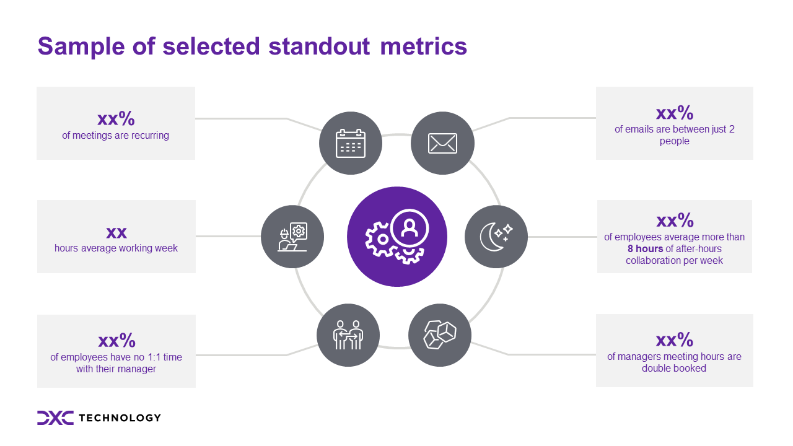
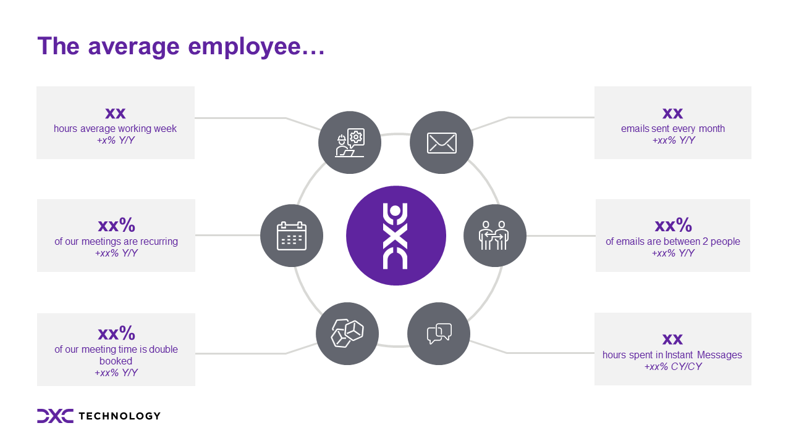
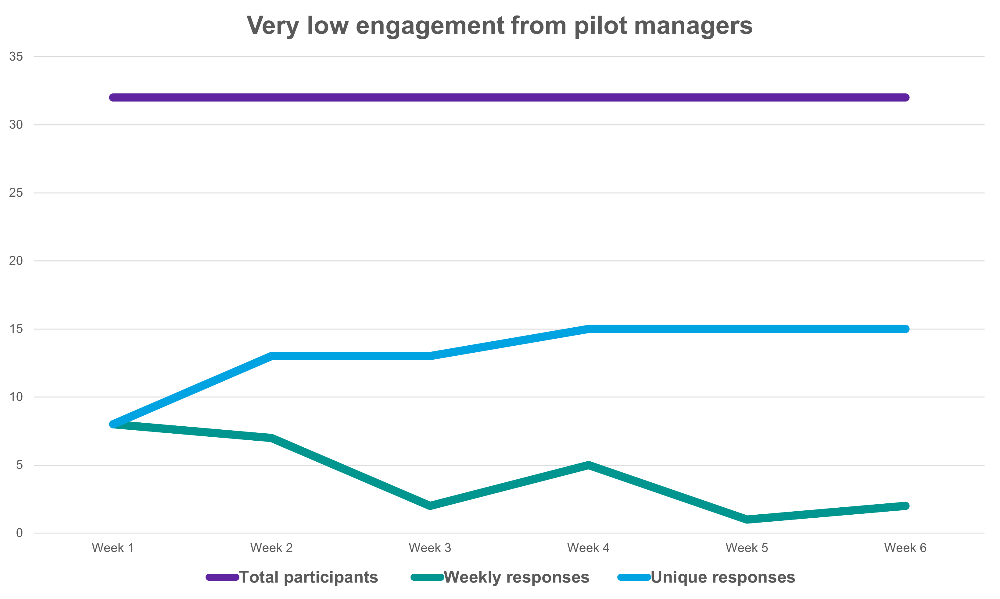

# Microsoft Viva Insights | Workplace Analytics
## A pilot approach

[Microsoft Viva Insights](https://www.microsoft.com/en-us/microsoft-viva/insights) is a employee analytics platform which unlocks the working behaviours of an organisation and how they actually work and collaborate within the Microsoft 365 eco-system (and beyond*)

_* through the analyses of external domain collaboration it's possible to extend the analysis beyond the walls of a single organisation_

## Preparation

There is a lot of noise around what Workplace Analytics is and isn't and I think it's important to address these upfront.

As you prepare to introduce the solution to your organisation identify and engage **very early** with representatives from at least the following groups:

- Human Resources
- Legal
- Cyber Security and Privacy
- Work Council
- Leadership within any pilot group

Outlining the scope of the solution and it's intent within an organisation is key and I would recommend the agreements reached are documented and published within a requirements or formal policy document.

Topics such as :
- minimum group size
- opt-out\in policy
- data and report access controls 

Plus callout any key principles which will be applied, for example "**employee anonymity is non-negotiable**"

## Technical integrations

Enabling the solution is very straight forward, following the documented requirements for organisation data I was able to secure a regular export from our HR system (Workday) to meet the minimum requirements, plus a number of additional fields to support the pilot.

## The scope of the pilot

The solution has 3 clear target audiences, with this in mind I outlined 3 hypothesis' I wanted to explore:

#### H1 : Can the insights support senior **leaders** as they define and monitor the transformation of DXC?
#### H2 : Can the insights be provided to individual **managers** to action and drive marginal improvements?
#### H3 : Are **individuals** gaining insights and value from their MyInsights emails and personal portal?

To introduce the topic to each leader and manager group I selected 6 key metrics, pulled from the detailed PowerBi reports and filtered down to their individual team or organisation.  This has a very positive impact and immediately grabbed each teams attention.    "these are your numbers, these are your recommendations"

The 6 **standout** metrics I included where:

- % of time spent in recurring meetings
- average working week (hours)
- % of employees with no 1:1 time with their manager
- Number of emails are between just 2 people
- % of employees average more than 14 hours of after-hours collaboration per week
- % of managers meeting hours are double booked

 
_Example of the standout metrics shared with leaders_

## The leaders experience

Ensure you are discussing the metrics and recommendations with leaders who have the ability to drive the required changes, without the correct context and understanding many of the insights and recommendations can portray a negative impression.   Discussing these openly with the leaders who correctly understand the operations within an organisation can help level set many of the insights.    The standout metrics should also provide the evidence needed to support a number of existing hypothesis and can be taken into senior leadership discussions to help reinforce the recommendations being made.

Working with HR leadership in 2 key regions, 

## The managers experience 
For each pilot team and group I defined a clear set of weekly goals, over a 6 week period.   A detailed welcome\getting starting presentation was provided to them after their kick-off calls.

### Week 1 : Initial impressions
- Don't trip and find the answer after the first week, review, digest and let the information and recommendations sink in.

### Week 2 : Personal Insights
- Are managers already aware and using their weekly personal My Insights emails?
- Do they have any personal plans set-up (focus, collaboration)

### Week 3 : Area(s) of interest
- Which topic area or individual report is drawing your attention?

### Week 4 : Sharing and discussing with your team
- Has the manager shared or planning to share the results and recommendations with their team?

### Week 5 : Coaching and support
- Can the solution be used as a self-service tool for managers?
- What level of coaching and training should be provided for any large scale deployments?

### Week 6 : Final Impressions
- Does the manager feel they have been able to implement any improvements for marginal gains over the course of the pilot?

## The individual experience

During the pilot we ran an internal meeting with the collaboration guild to share and discuss our personal usage of the My Analytics solution.   To kick off the meeting I took the same 6 metrics presented to the leaders and managers, but this time showed the values for an average employee based in the UK.   The discussion was excellent and called out many interesting areas; ranging from "I thought it was just a weekly junk email" to "this has really helped me understand the organisation".    Drawing attention to the key metrics and referencing the supporting research and recommendations, provided a good opportunity to highlight certain areas where an individual can take full control of their own calendars.

 
_Example of the average employee metrics shared with individuals_

## Results & Retrospective
Whilst I won't share any metrics or confidential information here, the results of the pilot were mixed.  **Leaders** who engaged and were able to easily connect the metrics and recommendations to either existing strategic programs or start a discussion on potential areas to address and did see high value within the solution; there was also interest in comparing the employee survey (through Glint) against the insights within WPA (sadly this wasn't explored as I think allowing someone who is about to leave an organisation access to the raw glint data wasn't something the organisation was willing to do).    
 
It was a very different experience with the **managers**, the drop-off of engagement was sharp following the first few weeks (25% responding the first week to only 3% by week 6)..  Failing of the solution? or a failing to the self-service approach I took?  Underlying cultural issue within the organisation?  Maybe a little a mix of all 3.
 
 

From the **individual** experience, I think the discussion sessions we ran highlighted some real potential of the solution and that an organisations should define supporting programs around this solution, driving both awareness but also emphasize that employees have the ability to own their own calendars and should find a working pattern which suits them - especially in a hybrid working model.