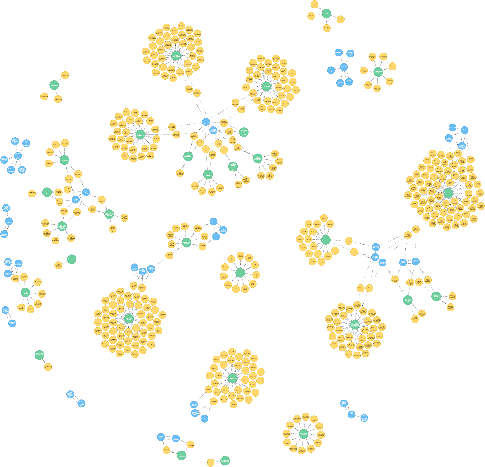

# Similar Ideas within the DE data set

:bulb: grab the DE dataset from [here](https://github.dxc.com/MyDXCGraph/DigitalExplorerDataSet) 

The DE model has different node labels, but the model matches the example given in the ComplexModel notes

`(i:ClientIdea)-[:ASSIGNED]->(cd:ClientDisruptor)-[:SPECIALIZES]->(mt:BusinessTrend)`

~~~
MATCH (i:ClientIdea)-[:ASSIGNED]->(cd:ClientDisruptor)-[:SPECIALIZES]->(mt:BusinessTrend)
WITH {item:id(i), categories: collect(id(mt))} as TrendData
WITH collect(TrendData) as data
CALL algo.similarity.jaccard.stream(data)
YIELD item1, item2, count1, count2, intersection, similarity
RETURN algo.getNodeById(item1).name AS from, algo.getNodeById(item2).name AS to, intersection, similarity
ORDER BY similarity DESC
~~~

### Store the similarity score

~~~
MATCH (i:ClientIdea)-[:ASSIGNED]->(cd:ClientDisruptor)-[:SPECIALIZES]->(mt:BusinessTrend)
WITH {item:id(i), categories: collect(id(mt))} as TrendData
WITH collect(TrendData) as data
CALL algo.similarity.jaccard(data, {topK: 1, similarityCutoff: 0.1, write:true})
YIELD nodes, similarityPairs, write, writeRelationshipType, writeProperty, min, max, mean, stdDev, p25, p50, p75, p90, p95, p99, p999, p100
RETURN nodes, similarityPairs, write, writeRelationshipType, writeProperty, min, max, mean, p95
~~~

~~~
MATCH (i:ClientIdea)-[r:SIMILAR]-(ClientIdea),(i)-[*1..2]-(t:BusinessTrend),(t)--(cd:ClientDisruptor)
WHERE r.score > 0.6
RETURN i,t,cd
~~~

---

### Version 2 - includes both business and technology trends

~~~
MATCH (i:ClientIdea)-[:ASSIGNED]->(cd:ClientDisruptor)-[:SPECIALIZES]->(mt)
WITH {item:id(i), categories: collect(id(mt))} as TrendData
WITH collect(TrendData) as data
CALL algo.similarity.jaccard.stream(data)
YIELD item1, item2, count1, count2, intersection, similarity
RETURN algo.getNodeById(item1).name AS from, algo.getNodeById(item2).name AS to, intersection, similarity
ORDER BY similarity DESC
~~~

~~~
MATCH (i:ClientIdea)-[:ASSIGNED]->(cd:ClientDisruptor)-[:SPECIALIZES]->(mt)
WITH {item:id(i), categories: collect(id(mt))} as TrendData
WITH collect(TrendData) as data
CALL algo.similarity.jaccard(data, {topK: 1, similarityCutoff: 0.1, write:true})
YIELD nodes, similarityPairs, write, writeRelationshipType, writeProperty, min, max, mean, stdDev, p25, p50, p75, p90, p95, p99, p999, p100
RETURN nodes, similarityPairs, write, writeRelationshipType, writeProperty, min, max, mean, p95
~~~

## TO DO
- remove ideas 2 trends where only a single trend is included within the idea - why?  only interested in ideas with more than 2 trends - looking for compounds