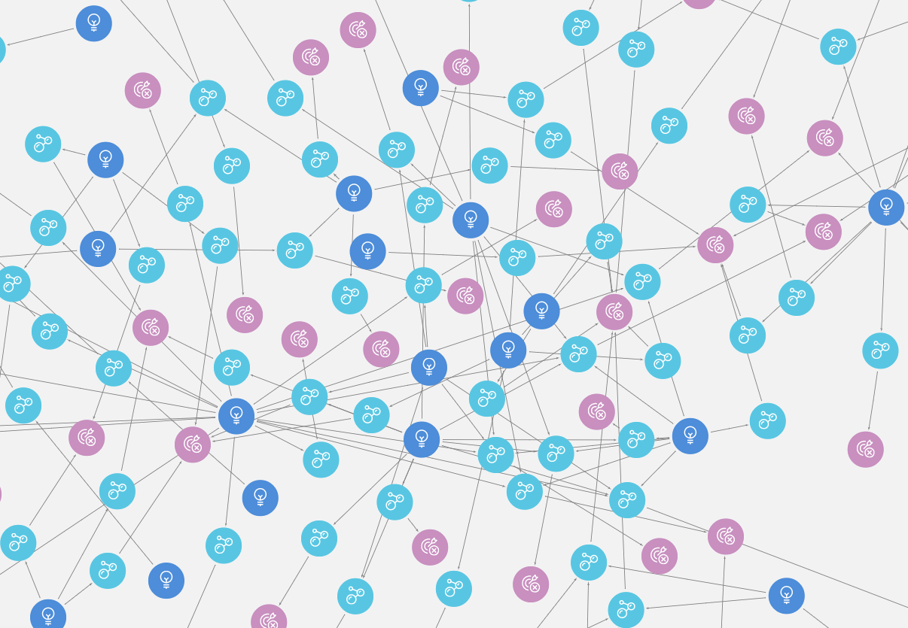
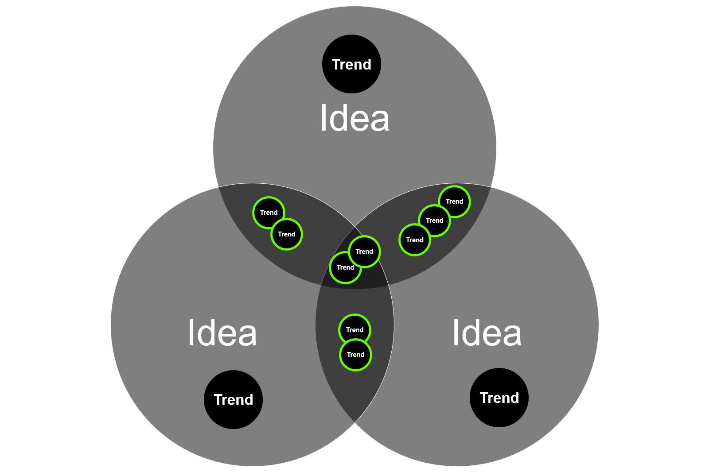

## Problem Statement

### **How to make sense of this view?...  lots of trends, lots of ideas**
### **but what are the common themes here?**

_focus trends (ClientDisruptors) are assigned to ideas_ 
_ClientDisruptors are specialized from the master trend_

~~~
match (ci:ClientIdea)-[:ASSIGNED]->(cd:ClientDisruptor)-[:SPECIALIZES]->(trend:BusinessTrend)
return trend, cd, ci limit 50
~~~
## Aim
Find community of common trends (2 or more) assigned to ideas
 
 
i.e.  
[TREND 1, TREND 2, TREND 3] have a frequency of x% across all ideas 
[TREND 1, TREND 3, TREND 6] have a frequency of x% across all ideas 
[TREND 3, TREND 6] have a frequency of x% across all ideas 

---

## Getting started...
- download latest DE production dataset https://github.dxc.com/MyDXCGraph/DigitalExplorerDataSet 
- using Neo4j desktop
- install new local DE project (3.4.7+)
- extract the DE dataset
- install the required plugin (APOC & Graph Algorithms)
- start the database (note it will upgrade the database to 3.4.7)
- check the required algorithms is available
    - `CALL algo.list` 
     check for **`algo.similarity.jaccard`**
- Reference : https://neo4j.com/docs/graph-algorithms/current/algorithms/similarity-jaccard/ 
---

## Examples and working scripts

## [Example against a simple Idea and Trends model](testScriptsSimpleModel.md)
## [Example against a Complex Idea and Trends model](testScriptsComplexModel.md)
## [Queries against the Digital Explorer Dataset](DEDataSet.md)
