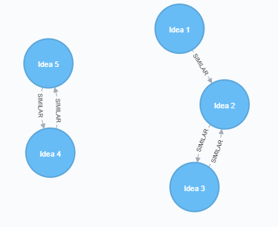
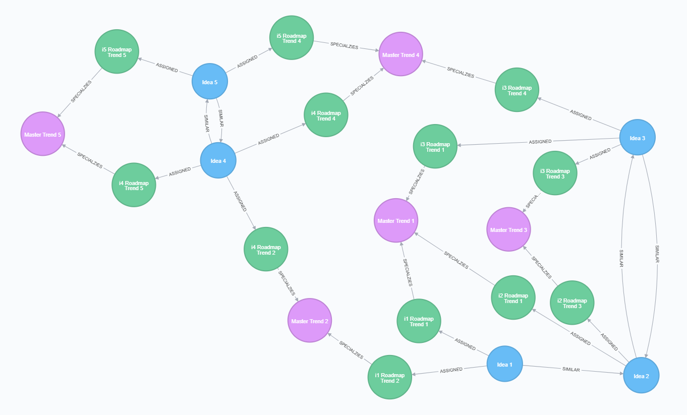

# Examples scripts for testing against a complex model
- This model reflects the configuration within Digital Explorer, where a copy is made of each "master trend" included within the roadmap
## Setup stage 1

:bulb: Try within an empty Neo4j database project 
:bulb: Ensure you have APOC and ALGO plugins installed.

 
**`(ClientIdea)-[:ASSIGNED]->(RoadmapTrend)-[:SPECIALIZES]->(MasterTrend)`**

~~~
MERGE (mt1:MasterTrend {name:'Master Trend 1'})
MERGE (mt2:MasterTrend {name:'Master Trend 2'})
MERGE (mt3:MasterTrend {name:'Master Trend 3'})
MERGE (mt4:MasterTrend {name:'Master Trend 4'})
MERGE (mt5:MasterTrend {name:'Master Trend 5'})

MERGE (i1:ClientIdea {name: 'Idea 1'})
MERGE (i2:ClientIdea {name: 'Idea 2'})
MERGE (i3:ClientIdea {name: 'Idea 3'})
MERGE (i4:ClientIdea {name: 'Idea 4'})
MERGE (i5:ClientIdea {name: 'Idea 5'})

MERGE (i1)-[:ASSIGNED]->(i1rt1:RoadmapTrend {name:'i1 Roadmap Trend 1'})-[:SPECIALIZES]->(mt1)
MERGE (i1)-[:ASSIGNED]->(i1rt2:RoadmapTrend {name:'i1 Roadmap Trend 2'})-[:SPECIALIZES]->(mt2)

MERGE (i2)-[:ASSIGNED]->(i2rt3:RoadmapTrend {name:'i2 Roadmap Trend 3'})-[:SPECIALIZES]->(mt3)
MERGE (i2)-[:ASSIGNED]->(i2rt1:RoadmapTrend {name:'i2 Roadmap Trend 1'})-[:SPECIALIZES]->(mt1)

MERGE (i3)-[:ASSIGNED]->(i3rt3:RoadmapTrend {name:'i3 Roadmap Trend 3'})-[:SPECIALIZES]->(mt3)
MERGE (i3)-[:ASSIGNED]->(i3rt4:RoadmapTrend {name:'i3 Roadmap Trend 4'})-[:SPECIALIZES]->(mt4)
MERGE (i3)-[:ASSIGNED]->(i3rt1:RoadmapTrend {name:'i3 Roadmap Trend 1'})-[:SPECIALIZES]->(mt1)

MERGE (i4)-[:ASSIGNED]->(i4rt5:RoadmapTrend {name:'i4 Roadmap Trend 5'})-[:SPECIALIZES]->(mt5)
MERGE (i4)-[:ASSIGNED]->(i4rt4:RoadmapTrend {name:'i4 Roadmap Trend 4'})-[:SPECIALIZES]->(mt4)
MERGE (i4)-[:ASSIGNED]->(i4rt2:RoadmapTrend {name:'i4 Roadmap Trend 2'})-[:SPECIALIZES]->(mt2)

MERGE (i5)-[:ASSIGNED]->(i5rt5:RoadmapTrend {name:'i5 Roadmap Trend 5'})-[:SPECIALIZES]->(mt5)
MERGE (i5)-[:ASSIGNED]->(i5rt4:RoadmapTrend {name:'i5 Roadmap Trend 4'})-[:SPECIALIZES]->(mt4)
~~~

### Find the number of similar connections

- the difference here, is we need to traverse through the `RoadmapTrend` node and find the similarity based on the `MasterTrend`

~~~
MATCH (i:ClientIdea)-[:ASSIGNED]->(RoadmapTrend)-[:SPECIALIZES]-(MasterTrend)
WITH {item:id(i), categories: collect(id(MasterTrend))} as TrendData
WITH collect(TrendData) as data
CALL algo.similarity.jaccard.stream(data)
YIELD item1, item2, count1, count2, intersection, similarity
RETURN algo.getNodeById(item1).name AS from, algo.getNodeById(item2).name AS to, intersection, similarity
ORDER BY similarity DESC
~~~

**Returns**
These should be the same as from the simple model tests 

### Simple test output
|from|to|intersection|similarity
|---|---|---|---
Idea 2|Idea 3|2|0.6666666666666666
Idea 4|Idea 5|2|0.6666666666666666
Idea 1|Idea 2|1|0.3333333333333333
Idea 1|Idea 3|1|0.25
Idea 1|Idea 4|1|0.25
Idea 3|Idea 5|1|0.25
Idea 3|Idea 4|1|0.2
Idea 1|Idea 5|0|0.0
Idea 2|Idea 4|0|0.0
Idea 2|Idea 5|0|0.0

### Complex model test output (i've left the " marks in to hopefully help)
from|to|intersection|similarity
|---|---|---|---
"Idea 2"|"Idea 3"|2|0.6666666666666666
"Idea 4"|"Idea 5"|2|0.6666666666666666
"Idea 1"|"Idea 2"|1|0.3333333333333333
"Idea 1"|"Idea 3"|1|0.25
"Idea 1"|"Idea 4"|1|0.25
"Idea 3"|"Idea 5"|1|0.25
"Idea 3"|"Idea 4"|1|0.2
"Idea 1"|"Idea 5"|0|0.0
"Idea 2"|"Idea 4"|0|0.0
"Idea 2"|"Idea 5"|0|0.0

Adding **`{similarityCutoff: 0.0}`** to the **`stream(data)`** call removes any ideas with no shared connections

~~~
MATCH (i:ClientIdea)-[:ASSIGNED]->(RoadmapTrend)-[:SPECIALIZES]-(MasterTrend)
WITH {item:id(i), categories: collect(id(MasterTrend))} as TrendData
WITH collect(TrendData) as data
CALL algo.similarity.jaccard.stream(data, {similarityCutoff: 0.0})
YIELD item1, item2, count1, count2, intersection, similarity
RETURN algo.getNodeById(item1).name AS from, algo.getNodeById(item2).name AS to, intersection, similarity
ORDER BY similarity DESC
~~~

**Returns**

|from|to|intersection|similarity
|---|---|---|---
Idea 2|Idea 3|2|0.6666666666666666
Idea 4|Idea 5|2|0.6666666666666666
Idea 1|Idea 2|1|0.3333333333333333
Idea 1|Idea 3|1|0.25
Idea 1|Idea 4|1|0.25
Idea 3|Idea 5|1|0.25
Idea 3|Idea 4|1|0.2

## Find similar ideas

~~~
MATCH (i:ClientIdea)-[:ASSIGNED]->(RoadmapTrend)-[:SPECIALIZES]-(MasterTrend)
WITH {item:id(i), categories: collect(id(MasterTrend))} as TrendData
WITH collect(TrendData) as data
CALL algo.similarity.jaccard.stream(data, {topK: 1, similarityCutoff: 0.0})
YIELD item1, item2, count1, count2, intersection, similarity
RETURN algo.getNodeById(item1).name AS from, algo.getNodeById(item2).name AS to, similarity
ORDER BY from
~~~

|from|to|similarity
|---|---|---|
Idea 1|Idea 2|0.3333333333333333
Idea 2|Idea 3|0.6666666666666666
Idea 3|Idea 2|0.6666666666666666
Idea 4|Idea 5|0.6666666666666666
Idea 5|Idea 4|0.6666666666666666

### Store the similarity values in a relationship 

~~~
MATCH (i:ClientIdea)-[:ASSIGNED]->(RoadmapTrend)-[:SPECIALIZES]-(MasterTrend)
WITH {item:id(i), categories: collect(id(MasterTrend))} as TrendData
WITH collect(TrendData) as data
CALL algo.similarity.jaccard(data, {topK: 1, similarityCutoff: 0.1, write:true})
YIELD nodes, similarityPairs, write, writeRelationshipType, writeProperty, min, max, mean, stdDev, p25, p50, p75, p90, p95, p99, p999, p100
RETURN nodes, similarityPairs, write, writeRelationshipType, writeProperty, min, max, mean, p95
~~~

We can then query for ideas with a high similarity score and review the trends which make them similar.

~~~
MATCH (i:ClientIdea)-[r:SIMILAR]-(ClientIdea),(i)-[*1..2]-(t:MasterTrend),(t)--(rt:RoadmapTrend)
WHERE r.score > 0.3 
RETURN i,t,rt
~~~

