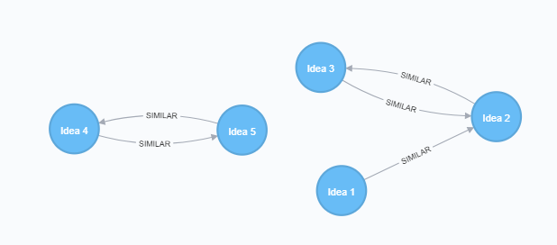
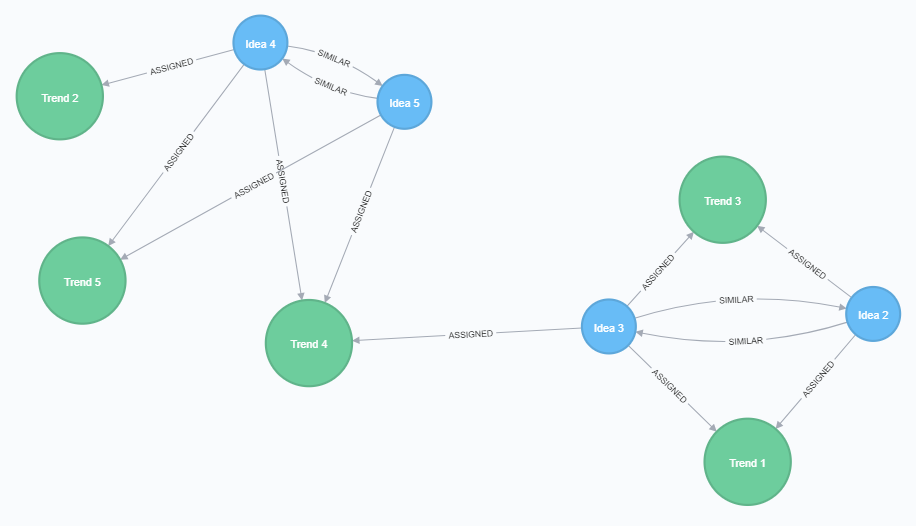

# Examples scripts for testing against a simple model

## Setup stage 1

:bulb: Try within an empty Neo4j database project 
:bulb: Ensure you have APOC and ALGO plugins installed.

 
**`(Idea)-[:ASSIGNED]->(Trend)`**

~~~
MERGE (t1:Trend {name:'Trend 1'})
MERGE (t2:Trend {name:'Trend 2'})
MERGE (t3:Trend {name:'Trend 3'})
MERGE (t4:Trend {name:'Trend 4'})
MERGE (t5:Trend {name:'Trend 5'})

MERGE (i1:Idea {name: 'Idea 1'})
MERGE (i2:Idea {name: 'Idea 2'})
MERGE (i3:Idea {name: 'Idea 3'})
MERGE (i4:Idea {name: 'Idea 4'})
MERGE (i5:Idea {name: 'Idea 5'})

MERGE (i1)-[:ASSIGNED]->(t1)
MERGE (i1)-[:ASSIGNED]->(t2)

MERGE (i2)-[:ASSIGNED]->(t3)
MERGE (i2)-[:ASSIGNED]->(t1)

MERGE (i3)-[:ASSIGNED]->(t3)
MERGE (i3)-[:ASSIGNED]->(t4)
MERGE (i3)-[:ASSIGNED]->(t1)

MERGE (i4)-[:ASSIGNED]->(t5)
MERGE (i4)-[:ASSIGNED]->(t4)
MERGE (i4)-[:ASSIGNED]->(t2)

MERGE (i5)-[:ASSIGNED]->(t5)
MERGE (i5)-[:ASSIGNED]->(t4)
~~~

### Find the number of similar connections

~~~
MATCH (i:Idea)-[:ASSIGNED]->(Trend)
WITH {item:id(i), categories: collect(id(Trend))} as TrendData
WITH collect(TrendData) as data
CALL algo.similarity.jaccard.stream(data)
YIELD item1, item2, count1, count2, intersection, similarity
RETURN algo.getNodeById(item1).name AS from, algo.getNodeById(item2).name AS to, intersection, similarity
ORDER BY similarity DESC
~~~

**Returns**

|from|to|intersection|similarity
|---|---|---|---
Idea 2|Idea 3|2|0.6666666666666666
Idea 4|Idea 5|2|0.6666666666666666
Idea 1|Idea 2|1|0.3333333333333333
Idea 1|Idea 3|1|0.25
Idea 1|Idea 4|1|0.25
Idea 3|Idea 5|1|0.25
Idea 3|Idea 4|1|0.2
Idea 1|Idea 5|0|0.0
Idea 2|Idea 4|0|0.0
Idea 2|Idea 5|0|0.0

Adding **`{similarityCutoff: 0.0}`** to the **`stream(data)`** call removes any ideas with no shared connections

~~~
MATCH (i:Idea)-[:ASSIGNED]->(Trend)
WITH {item:id(i), categories: collect(id(Trend))} as TrendData
WITH collect(TrendData) as data
CALL algo.similarity.jaccard.stream(data, {similarityCutoff: 0.0})
YIELD item1, item2, count1, count2, intersection, similarity
RETURN algo.getNodeById(item1).name AS from, algo.getNodeById(item2).name AS to, intersection, similarity
ORDER BY similarity DESC
~~~

**Returns**

|from|to|intersection|similarity
|---|---|---|---
Idea 2|Idea 3|2|0.6666666666666666
Idea 4|Idea 5|2|0.6666666666666666
Idea 1|Idea 2|1|0.3333333333333333
Idea 1|Idea 3|1|0.25
Idea 1|Idea 4|1|0.25
Idea 3|Idea 5|1|0.25
Idea 3|Idea 4|1|0.2

## Find similar ideas

~~~
MATCH (i:Idea)-[:ASSIGNED]->(Trend)
WITH {item:id(i), categories: collect(id(Trend))} as TrendData
WITH collect(TrendData) as data
CALL algo.similarity.jaccard.stream(data, {topK: 1, similarityCutoff: 0.0})
YIELD item1, item2, count1, count2, intersection, similarity
RETURN algo.getNodeById(item1).name AS from, algo.getNodeById(item2).name AS to, similarity
ORDER BY from
~~~

|from|to|similarity
|---|---|---|
Idea 1|Idea 2|0.3333333333333333
Idea 2|Idea 3|0.6666666666666666
Idea 3|Idea 2|0.6666666666666666
Idea 4|Idea 5|0.6666666666666666
Idea 5|Idea 4|0.6666666666666666

### Store the similarity values in a relationship 

~~~
MATCH (i:Idea)-[:ASSIGNED]->(Trend)
WITH {item:id(i), categories: collect(id(Trend))} as TrendData
WITH collect(TrendData) as data
CALL algo.similarity.jaccard(data, {topK: 1, similarityCutoff: 0.1, write:true})
YIELD nodes, similarityPairs, write, writeRelationshipType, writeProperty, min, max, mean, stdDev, p25, p50, p75, p90, p95, p99, p999, p100
RETURN nodes, similarityPairs, write, writeRelationshipType, writeProperty, min, max, mean, p95
~~~

We can then query for ideas with a high similarity score and review the trends which make them similar.

~~~
MATCH (i:Idea)-[r:SIMILAR]-(Idea),(i)--(t:Trend)
WHERE r.score > 0.6 
RETURN i,t
~~~

_Although I don't actually want to see the ASSIGNED relationship from Idea3 to Trend 4, as Idea 3 has no similarity to this side of the Graph_